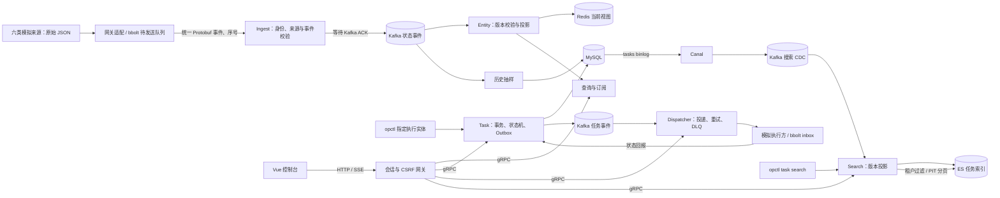

# MeshOps 多源实体实时协同与可靠任务调度平台

仓库根目录是唯一的完整实现，Go module：`example.com/meshops-course`。它使用模拟数据来源和模拟执行方，复现六类实体的统一接入、状态查询/订阅、inspect 任务下发与执行跟踪。旧骨架已移除，业务程序、协议、配置和脚本都在当前根目录。

**先看完成品：[完整前后端启动手册](docs/run-fullstack.md)。开始学习：[Z00—Z13 课程目录](docs/learning/from-zero/lessons/README.md)。** 教材与阶段答案位于 `docs/learning/from-zero/`，你自己的学习工程仍使用 `D:\job\golang\projects\meshops-course-lab`。

学习目录只复制各阶段需要的运行文件，不复制整套参考教材。本页的 `docs/` 导航用于在参考仓库中阅读；在自己的学习目录开发时，请从参考仓库打开课程和排错文档。

参考目录 `meshops` 用于运行完成版、阅读教材和核对答案；学习目录 `meshops-course-lab` 由你按照 Z01 从空文件夹创建，之后各课在同一学习目录增加或修改文件。不要将 `.cache/`、`.worktrees/` 或 `.local/` 凭证与运行数据整体复制到学习目录。Z11 增加 HTTP 网关，Z12 增加 Vue 控制台，Z13 将前后端、中间件和模拟器装入完整 Docker 演示。

## 先体验完整网页

启动 Docker Desktop 的 Linux engine，在本目录的 PowerShell 执行：

```powershell
./scripts/demo-stack.ps1 -Action Up
./scripts/account-admin.ps1 -Action Setup
```

打开 `http://localhost:18090`，用你刚设置的管理员用户名和密码登录，在账号管理页面创建操作员；操作员首次登录须修改初始密码。可查看六类实体实时状态、历史记录，创建及取消巡检任务，查看分发记录和搜索任务。管理员还可查看分发运行状态及执行受约束的人工重试。页面通过 HTTP/SSE 网关调用现有 gRPC 业务服务，结果来自真实 MySQL、Redis、Kafka 和 Elasticsearch。

“模拟演示”支持人员、无人机、车辆、机器人、传感器、设施各 **0—5 个**，默认各 1 个，总计最多 30 个。点击“应用数量”后等待实际启用，再到地图查看；支持暂停、断网缓存和恢复上报。数量缩减保留历史及已有任务，详见[模拟器与地图说明](docs/simulation-map.md)。

个人账号的初始化、停用、重置及验证步骤见[账号操作手册](docs/operations/accounts.md)。实体基数与写入速率分开设置，规模实验使用独立 Docker 环境，见[容量测试手册](docs/operations/scale-benchmark.md)；测试结果和边界以[本轮验收证据](verification/2026-09-13-accounts-scale/README.md)为准，配置一百万实体不等于已经证明百万并发。

Docker 模式不需要宿主机安装 Go、Node.js 或生成 Proto。首次构建需要下载镜像和依赖，网络排错、停止、重启、日志、搜索重建及本地 IDE 调试见[启动手册](docs/run-fullstack.md)。`Stop` 和 `Down` 保留数据卷，`Reset -ConfirmReset` 才清空独立演示数据。下文原有 CLI 路线用于后端学习，与 Docker 网页模式分别保存数据。

原定关键实现及 A01—A28 已有 [验收记录](verification/2026-09-10/summary.md)。**任务搜索（MySQL → Canal → Kafka → ES）已完成真实同步、依赖停机恢复、维护重建和 Z10 教程；独立学习目录的升级与故障后继续同步已通过验证。** Z09 保留加入搜索之前的教学范围；共同缺陷的修复会同步到适用阶段，新增搜索能力只在 Z10 引入。复制验证、已知边界及复核范围见 [工作记录](docs/learning/from-zero/BUILD-LEDGER.md)。

## 数据经过哪些地方



人员、无人机、地面车辆、巡检机器人可以执行同一种 `inspect`；固定传感器和设施仅提供状态。每个实体绑定一个权威来源，任务执行方由注册信息确定，操作员选择目标实体。本项目不包含路径规划、最优资源分配或真实设备控制。

## 本机前提

使用 PowerShell，以下命令的工作目录都为本文件所在目录。先确认工具在 PATH 中：

```powershell
go version
docker version
docker compose version
```

已使用 Go 1.25.10 构建；依赖版本以 [go.mod](go.mod) 和 [go.sum](go.sum) 为准。已提交 `gen/`，直接构建不要求先安装代码生成工具。修改 Proto 时才需要 `protoc`、`protoc-gen-go` 和 `protoc-gen-go-grpc`，工具获取与锁定版本见 [协议工具说明](testdata/proto/README.md)，生成时执行 [generate.ps1](scripts/generate.ps1)。生成代码不能手改。

在当前用户电脑上，若 PATH 未包含已安装的 Go，可在当前终端执行：

```powershell
$env:Path = 'D:\go1.25.10\bin;' + $env:Path
Set-Location 'D:\job\golang\projects\meshops'
```

其他电脑按实际 Go 安装路径设置；上述盘符不是 Go module 的一部分。`example.com` 是课程模块名中的占位域名，引用本模块文件时 Go 在本地寻找，运行本项目不用申请这个域名。

## 初始化、启动、实际演示

先启动 Docker Desktop 的 Linux engine，再执行：

```powershell
./scripts/initialize.ps1
./scripts/start.ps1 -Simulators
./scripts/demo.ps1
```

初始化脚本启动专用 Compose 服务、构建业务与工具程序（包含 `verify`、可选 Search 和本地搜索维护工具）、执行 001—005 增量迁移并导入来源/实体绑定。数据源与执行方凭证第一次运行时生成在 `.local/secrets.json`；再次运行会复用，避免已有队列突然失去身份。不要把这个文件提交到仓库。

启动脚本运行四个服务、六个来源模拟器和四个执行方。来源默认每秒上报两次、运行 30 分钟；过期后重新启动模拟来源，查询才能恢复新鲜状态。演示脚本验证六类查询、四类 inspect 成功、重复创建返回同一任务 ID，以及真实订阅；任一步失败就报错，详细证据写入 `results/`。

本工程使用以下本机地址，避免与旧工程的默认数据库端口混用：

| 程序/依赖 | 地址 |
| --- | --- |
| Ingest / Entity / Task / Dispatcher | `127.0.0.1:50051` / `50052` / `50053` / `50054` |
| 四个服务的健康与指标 | `127.0.0.1:18080` 至 `18083` |
| MySQL / Redis / Kafka | `127.0.0.1:13306` / `16379` / `19092` |
| 可选 Search gRPC / 健康与指标 | `127.0.0.1:50055` / `18084` |
| 可选 Elasticsearch HTTP | `127.0.0.1:19200` |

Search 与 Elasticsearch 需按下文 [可选任务搜索](#可选任务搜索) 单独初始化和启动；这些端口不是网页控制台入口。

每次打开新终端，先加载当前终端需要的凭证与地址：

```powershell
. ./scripts/env.ps1
./bin/opctl.exe snapshot --entity drone-001
./bin/opctl.exe subscribe --entities 'person-001,drone-001' --duration 10s
./bin/opctl.exe task create --entity drone-001 --key my-first-inspect --duration-seconds 1
```

创建响应的 `taskId` 是后续查询需要的实际值：

```powershell
$created = ./bin/opctl.exe task create --entity drone-001 --key another-inspect --duration-seconds 1 | ConvertFrom-Json
if ($LASTEXITCODE -ne 0) { throw 'create failed' }
./bin/opctl.exe task get --id $created.taskId
./bin/opctl.exe task history --id $created.taskId
./bin/opctl.exe dispatch get --task $created.taskId
./bin/opctl.exe dispatcher status --token-env MESHOPS_ADMIN_TOKEN
```

`opctl` 成功输出真实的 Protobuf JSON，错误 JSON 输出到 stderr。退出码 `0` 为成功，`1` 为运行或 RPC 失败，`2` 为命令参数错误。同一个幂等键只能重试相同的标准化创建参数；换参数时使用新键。

停止本次程序，但保留数据库和 bbolt 文件：

```powershell
./scripts/stop.ps1
```

Windows 的停止脚本采用强制进程退出，用于本地操作；服务收到正常退出信号时另有有界优雅退出逻辑。停止脚本按 PID、可执行文件路径和启动时间三者核对身份，不能只凭 PID 杀进程。要停数据库容器可执行 `docker compose stop`。

## 测试

```powershell
./scripts/test.ps1
./scripts/test.ps1 -Integration
./scripts/processes.test.ps1
```

第一条运行单元/本地网络测试及 `go vet`。第二条还会连接真实 MySQL、Redis、Kafka，需要先初始化 Compose；脚本会启动 16380 端口的专用 Redis 故障容器，在这个容器测试 OOM，并在随机测试主题执行 Kafka DeleteRecords。测试使用随机测试库、命名空间或主题，账户需有创建测试库权限。普通测试输出中的集成用例 `SKIP` 表示未执行，不能记为通过。

以下命令依次执行，先停止演示，不要与集成测试并行。故障脚本会实际停止并恢复本 Compose 的 Kafka/Redis/MySQL；压测会创建独立数据库、主题和实体命名空间，保留在 `.local/verification/<run-id>/` 供排查，不清空已有数据：

```powershell
./scripts/stop.ps1
./scripts/faults.ps1
./scripts/benchmark.ps1 -Profile mixed -Seconds 30
```

压测先核对 10000 个不同实体快照，再依次运行 100/500 events/s。报告给出实际吞吐、错误、客户端至 Kafka ACK 的延迟、抽样可见延迟、Lag 和进程 Go 堆内存。它不代表订阅扇出、网关落盘或任务执行的性能。每个计时阶段另有三分钟排空预算，整个命令上限十五分钟，超时会返回失败。

完整工程压测默认使用六类混合实体：人员/无人机/车辆/机器人各 2000，传感器/设施各 1000，共 10 个来源。`-Profile person` 可运行全人员对照；网页每类最多 5 个的限制不适用于独立压测。当前混合实测与同环境对照见[混合压测与运动验收](docs/verification/2026-09-12-motion-mixed/README.md)。2026-09-10 的历史压测仍是全人员，不能改写成混合实体结果。

安装 [锁定的协议工具](testdata/proto/README.md) 并加入 PATH 后，运行 `./scripts/verify-proto.ps1` 检查 lint、兼容性与生成一致性。独立模块相对原骨架的 Go import 和四个 optional 字段存在有意的源码接口差异，不能直接替换旧生成包。Linux 单元/竞态检查可用 `go test -race ./... -count=1`；需 C/C++ 编译器。[项目 CI](.github/workflows/ci.yml)直接验证根目录工程；本地检查不表示远端 Actions 已运行。

课程已有阶段连续复制和搜索升级验证；当前完整性以最新复核报告及其提交、命令和适用范围为准。代码测试通过不能直接推导“整套课程已验收”。

## 文件与职责

| 目录 | 需要理解的问题 |
| --- | --- |
| `proto/`、`gen/` | 请求/响应和流的边界；前者手写、后者生成 |
| `internal/platform/` | 配置、可信身份、来源绑定、连接和分页签名 |
| `internal/state/` | 原始格式适配、ACK、版本/墓碑、订阅和抽样历史 |
| `internal/bus/` | Kafka 发布确认、分区内顺序处理、手动提交与真实 Lag |
| `internal/tasks/` | 任务事实、事务、Outbox、投递尝试和状态回报 |
| `internal/edge/` | 断线补传队列、执行幂等、取消和模拟副作用 |
| `internal/app/` | 组装依赖、注册 RPC、健康检查和进程生命周期 |
| `internal/cli/` | 操作员真实客户端，包含查询、订阅和任务命令 |
| `migrations/`、`configs/`、`testdata/` | 表结构增量、注册信息、可复现原始输入 |

课程从少量文件开始逐步引入上述结构。此表用于最后回看职责，不要求第一课就创建全部目录。

## 当前排错入口

- `DeadlineExceeded`：核对客户端和配置中的地址，当前课程统一使用 IPv4 回环地址；再查看对应服务日志及 `/readyz`。
- 端口已占用：启动脚本会在启动前拒绝。先确认是否有已有课程进程，使用它所属的停止脚本；不要随意终止其他项目。
- 实体 `found=false`：确认对应来源已接入，查看 `.local/logs/来源名.err.log`；原始数据不会绕过 Ingest 自动写进 Redis。
- 实体已过期：检查来源模拟器是否已结束、网关是否有积压、Kafka 消费是否前进。过期状态仍可查询，不能据此接收新任务。
- 任务停在投递中：查看执行方日志、`dispatch get` 和 `task history`。传输失败会有限重试，不能把“写进 Kafka”当作执行成功。
- Docker Kafka 启动失败：检查 `docker compose logs kafka-init kafka`。Compose 中的初始化容器仅调整 Kafka 专用卷目录的属主，保留已有日志数据。

## 可选任务搜索

真实链路与早期运行记录见 [搜索运行记录](docs/learning/from-zero/verification/2026-09-11-search-runtime.md)。搜索扩展需要额外启动 Canal 和 Elasticsearch；按 [Z10 教程](docs/learning/from-zero/lessons/z10.md) 学习协议、实现、启动、查询和故障恢复，独立学习目录的验证见 [课程验收](docs/learning/from-zero/verification/2026-09-12-search-course.md)。

搜索初始化中断或 ES 任务索引丢失时，使用 `./scripts/rebuild-search.ps1` 在维护窗口从 MySQL 重建。原本未运行 Search 时，再执行 `./scripts/start-search.ps1`；随后用 `./scripts/demo-search.ps1` 核对新增任务同步。已完成的故障与数据保留检查见 [维护重建记录](docs/learning/from-zero/verification/2026-09-12-search-rebuild.md)。

## 本轮复核、排错与界面设计

四项交付、复验命令、教程复制和运行证据见 [全面复核验收记录](docs/review/2026-09-12/acceptance.md)。

- [完整问题台账](docs/review/2026-09-12/assessment.md)：逐条判定外部 28 项意见及自查新增问题，区分当前缺陷与旧报告状态。
- [脱敏证据归档](docs/review/2026-09-12/evidence/README.md)：逐测试终态、课程复制结果、原始文件 SHA-256，以及证据保留与清理边界；不依赖临时构建缓存才能阅读结论。
- [消费位点批量提交与性能边界](docs/operations/consumer-performance.md)：Z13 的成功前缀提交、重放要求和实测取舍。
- [本地排错知识库](docs/troubleshooting/README.md)：数据库锁、重放、投影恢复、SQL 执行计划、Git 换行和测试门禁。
- [前端 UI 设计与离线原型](docs/ui/README.md)：模拟交互，不连接真实业务；浏览器 BFF 和实体枚举等接入缺口在方案中明确列出。
- [当前工程验证边界](docs/production-readiness-checklist.md)：个人账号与机器令牌分离；单实例和有限压测不作为生产容量保证。

完整集成验收需 Python 3：`./scripts/test.ps1 -Integration` 会启动 ES 与专用故障 Redis、保存 JSON 结果，并拒绝关键测试缺失或业务测试跳过。在支持 CGO 的平台加 `-Race`；云端 CI 在依赖启动后运行全包 race。PowerShell 点调用与执行策略说明见 [课程导航](docs/learning/from-zero/README.md)。

### 实体地图与模拟器控制

控制台内置六类实体二维园区示意图，实时坐标来自 SSE；支持点击详情与任务联动。模拟演示页提供正常上报、暂停采集、断网缓存，展示实际心跳与待补传数量。操作方法、接口边界和验收脚本见[模拟器控制与地图](docs/simulation-map.md)。
