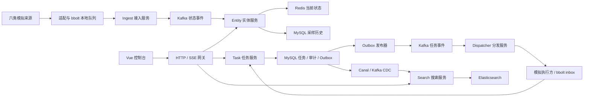

# MeshOps 面试介绍与追问准备

更新：2026-09-13。介绍对应当前完整前后端工程；搜索、个人账号、网页、模拟器和部署均已实现。百万实体试验已恢复推进，但当前没有百万容量通过结论。面试前快速复习见[速查卡](cheatsheet.md)。

下面是项目介绍模板。第一人称的“实现、排查、压测”应对应你实际完成并能解释的工作；参考工程已有实现和证据，不等于你已经亲自复现。背景依据你提供的联培经历，不补写企业名称、客户、生产部署或业务收益。

## 1. 先用一句话说清楚项目

MeshOps 是一个面向多类人员和设备的实时状态与任务协同平台：把不同来源上报的数据整理成统一实体视图，让操作员查看状态、选择具备能力的实体下发巡检任务，并追踪断线、重试及执行结果。

“多源”指多个异构数据来源；“实体”是被管理的对象。当前每个实体绑定一个权威来源，没有实现多个来源共同融合更新同一个实体。六种实体类型也不等于只有六个来源，一个类型可以有多个来源。

## 2. 背景怎么讲

> 我在研究生联培期间接触到这类多实体协同系统，并对 Lattice 的开放接口以及实体、任务模型做过调研。我从中提取了适合后端实现的通用需求：不同人员和设备的状态如何统一接入，操作员如何实时查看，以及任务在断线和重试时如何保持状态可信。在此基础上做了 MeshOps，使用六类模拟数据来源和模拟执行方搭建完整业务链路，园区巡检作为网页演示场景。

这一段解释了项目来源、需求和当前落地方式。项目借鉴实体与任务建模思路，没有复刻 Lattice 全部能力；园区只是具体演示背景，不需要扩成物业、门禁、资产、工单等完整运营系统。

### 用一个具体场景帮助面试官理解

操作员打开控制台，看到人员、无人机、车辆、机器人、固定传感器和设施的位置或状态。例如无人机显示电量、运行状态和任务能力，传感器显示读数与健康状态。操作员选择有 inspect 能力的无人机，创建一条巡检任务，观察创建、投递、执行回报和最终结果。

来源上报断网后，数据暂存在本地，恢复连接再补传；执行方断线则由独立任务链路处理投递与回报。网页“断网缓存”按钮控制的是来源上报链路，不会同时断开任务执行进程。任务执行目前模拟为本地结果事务，不控制真实无人机，也不规划飞行路线。

## 3. 口述介绍

### 30 秒版

> 我的项目叫 MeshOps，是一个多源实体实时协同与可靠任务下发平台。它来源于联培期间接触的多实体协同需求和对 Lattice 实体、任务模型的调研。目前接入人员、无人机等六类模拟实体，提供实时状态、历史查询、巡检任务下发和任务搜索。后端使用 Go、gRPC、Kafka、Redis 和 MySQL，重点处理异构数据统一、断线补传、重复消息和任务状态一致性，并配有网页和 Docker 演示环境。

### 约两分钟版

> 我的项目叫 MeshOps，是一个多源实体实时协同与可靠任务下发平台。背景是联培期间接触到多类人员和设备统一管理的需求，我也调研了 Lattice 的实体和任务模型，提取其中的通用后端需求做了这套实现。
>
> 从使用上看，操作员能在一个页面查看人员、无人机、车辆、机器人、传感器和设施的状态，查询历史，给具备能力的实体下发巡检任务，再跟踪结果和搜索任务。当前数据来源和执行方用模拟器实现，园区地图用来展示完整流程。
>
> 后端分成接入、实体、任务、分发和搜索五个服务进程，网页通过 HTTP/SSE 网关调用内部 gRPC。状态链路先把不同格式的数据归一化，在边缘侧用 bbolt 持久化待发送队列，中心接收并等待 Kafka 确认，再由实体服务投影到 Redis。Redis Lua 原子比较来源、版本和事件内容，处理重复、旧事件和删除标记，避免状态回退。
>
> 任务链路使用 MySQL 事务同时写任务、审计和 Outbox，后台异步发布。分发尝试和业务执行使用不同标识，执行方用持久收件箱保存命令与模拟结果，处理重发、取消和回报重试。搜索通过 MySQL、Canal、Kafka 同步到 ES，支持分页和失败后的重建。
>
> 我最想展开的是可靠任务这部分：任务创建成功、命令发出、执行完成分别代表不同事实，网络超时不能直接判断任务失败。项目围绕这些边界做了集成测试和故障演练。已有一万混合实体、十个来源的状态链路实测，在总计每秒五百条、持续三十秒的负载下，错误为零，结束时积压为零；这个结果没有覆盖整个系统的最大容量。

## 4. 实现了哪些功能

| 功能 | 用户可以做什么 | 后端需要解决什么 |
| --- | --- | --- |
| 六类实体接入 | 统一查看不同人员、设备和设施 | 原始格式转换、身份与归属校验、通用字段和类型组件 |
| 实时状态 | 查快照、按实体 ID 订阅、判断状态是否新鲜 | 原子版本投影、初始快照与增量衔接、慢订阅者处理 |
| 历史查询 | 回查一段时间的采样状态 | 抽样预算、历史保留、签名游标分页 |
| 巡检任务 | 指定实体创建、取消、查看执行和分发记录 | 状态机、幂等创建、事务 Outbox、执行键、回报去重 |
| 失败处理 | 查看超时和死信，管理员进行受约束的重试 | 投递意图、租约、ACK 超时、迟到回报与终态边界 |
| 任务搜索 | 按任务备注、状态等条件搜索并翻页 | CDC、ES 外部版本、租户过滤、PIT、完整导入与重建 |
| 个人账号 | 管理员创建/启停/重置操作员，本人改密，首次登录先改密 | Argon2id、数据库个人会话、认证版本、事务内撤销与审计、CSRF |
| 网页演示 | 地图、短轨迹、每类 0—5 个实体、暂停和断网缓存 | HTTP/SSE 网关、会话与角色校验、CSRF、实际状态反馈 |
| 运维验证 | 启停、看日志和指标、运行故障与压测脚本 | Docker Compose、健康探针、Prometheus 指标、pprof、测试门禁 |

人员、无人机、车辆和机器人可以执行同一种 inspect；传感器和设施只上报状态。任务执行方由可信注册信息确定，操作员选择目标实体。

## 5. 架构与技术栈怎么介绍

图中数据库到 Outbox 发布器的箭头表示读取待发记录，不表示数据库主动发送消息。Task 在需要时通过 gRPC 查询 Entity 的权威快照，说明 gRPC 同时用于服务间协作，不只是对外提供接口。

| 技术 | 当前具体用途 | 需要理解的取舍 |
| --- | --- | --- |
| Go、go-zero | 服务装配、配置、生命周期；业务规则放在独立包 | 框架提供基础能力，不会自动完成幂等、恢复和状态机 |
| gRPC、Protobuf | 内部强类型调用、来源上传流、订阅和命令接收流 | Subscribe 与 ListenTasks 是服务端流，不能把所有流式 RPC 都叫双向流 |
| grpc-gateway、HTTP/SSE | 浏览器一元请求转换、服务端持续推送 | SSE 用于浏览器接收状态，仍需认证、超时和重连同步 |
| Kafka | 持久事件、分区顺序、重放和消费者位点 | 处理成功再提交位点；重复仍可能发生，必须业务幂等 |
| Redis、Lua | 当前视图、来源/版本/事件身份的原子判断 | Redis 是派生视图，业务新鲜度与物理删除是两回事 |
| MySQL | 任务事实、账号与会话、审计、Outbox、投递记录、采样历史 | 同库事务覆盖数据库内事实，不覆盖 Kafka 和设备动作 |
| Argon2id、Cookie Session | 个人密码存储、网页会话与可信 RPC 身份 | 密码哈希和随机令牌索引用途不同；哈希成本、限流、撤销和失效检查都要实现 |
| bbolt | 来源待发队列、执行方持久 inbox 和模拟结果 | 单进程本地事务文件，需要容量和留存边界，不是自研存储引擎 |
| Canal、Elasticsearch | 从任务事实构建可重建搜索索引 | 最终一致，需要引导、版本、防冲突和维修流程 |
| Vue 3、Element Plus | 完整操作台与地图示意 | 展示真实后端返回数据；短轨迹只是本页收到的位置 |
| Docker Compose、Nginx | 本机成套部署和网页入口 | 方便复现，没有据此验证跨机高可用 |
| slog、Prometheus、pprof | 日志、指标、性能定位 | 暴露工具入口不等于已经定位过所有性能瓶颈 |

核心业务进程是 Ingest、Entity、Task、Dispatcher、Search，另有浏览器网关。模拟器、CLI、初始化和验收程序不应全部算成微服务。当前采用静态服务地址或 Compose 服务名，不因 go.mod 有间接依赖就宣称使用了 etcd、Kubernetes、链路追踪平台等能力。

## 6. 可以展开的五个亮点

### 亮点一：统一实体模型，保留不同类型的差异

人员的在岗状态、无人机的电量、传感器的读数不能都塞成同一组必填字段。模型用公共标识、位置和可选类型组件表达不同对象；缺少电量表示未知或不适用，明确的零电量才表示耗尽。原始数据经过对应适配器归一化，来源归属和任务能力由可信配置决定，不能靠设备自己上报来扩大权限。

证据：[原始格式适配](../../internal/state/adapters.go)、[输入与归属校验](../../internal/state/validation.go)、[实体协议](../../proto/common/v1/entity.proto)。

### 亮点二：把断线、重复、旧事件和重建缺口分别处理

来源在本地事务中同时分配版本和保存事件，未确认数据保留；重连重发原事件。Ingest 等 Kafka 确认后返回连续 ACK，Entity 用 Lua 原子比较来源代次、版本、event_id 与内容摘要。旧版本不能覆盖新版本，相同版本只有相同身份和内容才视为重复；删除保留墓碑，避免旧上报让对象复活。

Kafka 处理成功但位点未提交时，恢复会再次消费。因此介绍为“至少一次传递＋业务幂等”。如果保留窗口已经删掉所需历史，严格消费者拒绝假装完整；重建另需可验证的起点和期望清单。Lag 为零只说明追上日志末尾，不能证明丢失的历史已经回来。

证据：[本地队列](../../internal/edge/queue.go)、[补传](../../internal/edge/uplink.go)、[原子投影](../../internal/state/entity.go)、[严格消费](../../internal/bus/kafka.go)、[恢复排错](../troubleshooting/09-projection-recovery.md)。

### 亮点三：可靠任务是三种事实的一致协作

任务事实由 Task 管理；每次投递事实由 Dispatcher 管理；模拟执行结果保存在执行方。MySQL 同事务写任务、审计、Outbox，发布成功但标记失败会重发同一事件。分发使用行锁、租约和有界重试，稳定 execution_key 与 dispatch_id/attempt 分开，重发不代表新业务操作。

执行方先保存命令，再保存模拟结果及待回报信息；收到重复命令可复用已有结果。取消是请求，投递超时是通信状态，都不能直接当作“设备已停止”或“任务已失败”。真实外部动作若不能和本地记录一起事务提交，仍需设备端幂等协议或结果核对；本项目 effect_count=1 只验证模拟结果事务，不保证真实机械动作恰好一次。

证据：[任务服务](../../internal/tasks/service.go)、[Outbox 发布](../../internal/tasks/workers.go)、[投递 worker](../../internal/tasks/dispatch_worker.go)、[执行收件箱](../../internal/edge/inbox.go)、[回报授权](../troubleshooting/03-report-dispatch-intent.md)。

### 亮点四：搜索包含可恢复的全量与增量链路

Task 只写 MySQL，Canal 将 binlog 变化送到 Kafka，由 Search 投影到 ES。用业务状态版本防止旧更新覆盖新文档；搜索结果是最终一致的，操作任务前仍回查任务事实。分页使用 PIT 和绑定租户、条件的签名游标。

全量引导要记录一致性快照对应的 binlog 起点，写完索引后才提交完成标记，并绑定索引 UUID 与消费起点。中途失败不能把半份索引当作就绪。当前任务表 CDC 对不支持的 DELETE/DDL 采取停止推进并报错的策略，修复后按维护流程恢复，不能为了降低 Lag 而跳过记录。

证据：[一致性快照](../../internal/search/snapshot.go)、[引导与恢复](../../internal/search/bootstrap.go)、[版本索引](../../internal/search/index.go)、[查询分页](../../internal/search/query.go)、[实际搜索验收](../review/2026-09-12/acceptance.md)。

### 亮点五：个人身份从网页进入 RPC，撤销不能只靠退出按钮

管理员在部署机器上通过 CLI 安全输入初始密码，再在页面创建操作员。密码采用 Argon2id，独立 16 字节盐，64 MiB 内存、3 次迭代、并行度 1、32 字节输出；密码长度和编码、哈希串参数及同时进行的昂贵计算都有限制，登录入口还要限流。随机盐让相同密码产生不同哈希；哈希参数有边界，不能信任任意编码把内存放大。SHA-256 只用于高熵随机会话令牌的数据库查找，不替代密码哈希。

浏览器拿到一个不透明 HttpOnly/SameSite Cookie，网关内存把它映射到另一个随机内部 RPC 令牌。数据库保存内部令牌的查找哈希、账号 ID、认证版本和有效期。RPC 拦截器解析可信个人身份，角色、tenant 和 actor 不接受浏览器自行指定，所以任务 `createdBy` 能对应个人账号；来源、执行方仍使用原机器凭证。网关重启需要重新登录，MySQL 中的账号和密码哈希仍保留。

停用、重置或修改密码时，在 MySQL 事务内锁定目标账号，检查目标租户/角色，更新密码或启停状态并增加认证版本，删除该账号已有内部会话，同时写账号审计。管理操作还在同一事务重验调用者及其有效会话，避免入口已经解析过的旧 Principal 在调用者被撤销后继续改账号。本人改密在完成昂贵哈希后重验版本，防止与并发重置互相覆盖。事务提交后当前网关取消对应 SSE，后续 HTTP/RPC 查库也会拒绝失效令牌；不是只删除浏览器 Cookie 就宣称已撤销。

验证按真实行为检查：重复/并发 Setup 不产生第二个初始管理员，不覆盖原密码；新操作员登录只能改密；跨租户和非管理员请求被拒绝；改密/停用/重置/注销后，旧 HTTP、RPC 和 SSE 不能继续按原会话使用。本次 Windows 真实依赖运行有 216 个顶层 PASS、3 个辅助 SKIP，23 项必需集成门禁 PASS；30 项真实 HTTP 账号流程与个人任务审计回归已通过。最新 Windows 普通测试为 [168 PASS（unit-release）](../../verification/2026-09-13-accounts-scale/unit-release.summary.json)，先前 Linux 普通 race 为 162 PASS；两次普通运行各有 22 项 SKIP（20 项外部依赖门控、2 项 edge/state 崩溃子进程辅助入口），因此不能称为真实依赖 race 已通过。可按[安全输入与 HTTP 验收步骤](../operations/accounts.md#运行-30-项真实-http-账号检查)亲自复现。

代码与复现入口：[密码实现](../../internal/accounts/password.go)、[账号事务与撤销](../../internal/accounts/store.go)、[RPC 鉴权](../../internal/platform/auth.go)、[账号手册](../operations/accounts.md)。这个范围包含个人账号管理，不包含公开注册、邮件找回、单点登录或完整 IAM 平台。

## 7. 怎样回答“和电商、短视频项目相比，特点是什么”

> 这个项目的特点是异构实体与断续连接：不同实体上报的状态结构不同，信息可能过期；网络恢复会补发旧数据；任务创建、命令投递和实际执行又是三个不同阶段。我把这些问题落实成了版本投影、本地持久队列、事务 Outbox、执行幂等和恢复验证。它能体现后端数据一致性、异步通信和故障处理能力。

电商、短视频项目同样可以做得深入。无需声称题材天然更高级，也无需用无人机数量或中间件数量证明价值。面试时选择你能讲清楚的两到三个问题，按“出现什么现象—为什么—如何处理—怎样验证”展开。

## 8. 已归档混合压测与本次规模试验

来源：[2026-09-12 混合压测报告](../verification/2026-09-12-motion-mixed/README.md)。人员、无人机、车辆、机器人各 2000，传感器和设施各 1000，共 10000 实体、10 个来源。

| 总提供负载 | 持续时间 | 实际接收速率 | Kafka ACK P99 | 抽样查询可见 P99 |
| --- | --- | --- | --- | --- |
| 100 条/秒 | 30 秒 | 99.99 条/秒 | 1.391 ms | 2.960 ms |
| 500 条/秒 | 30 秒 | 499.90 条/秒 | 1.449 ms | 3.053 ms |

各档接收错误、生成器排队丢弃、抽样观测遗漏和最终两类消费 Lag 为 0。预热逐一核对了 10000 个实体快照。500 档为 300 个可见性样本，抽样覆盖十个来源，不是每条事件都测量可见性。

验证器和两个 Go 服务在同一个 Linux Docker 容器内共享 4 CPU / 4 GiB 限额，数据库等依赖在限额外，后台演示约 12 条/秒继续运行。范围是 Ingest → Kafka → Entity → Redis/MySQL，不含边缘 bbolt、任务执行、订阅扇出、搜索查询并发，也没有测试一万个地图点位渲染。500 是全部来源合计，不是一万个实体各自每秒上报。旧 Windows 全人员报告保留历史用途，不与本表混用。

### 被问到“百万实体怎样测”

目前已实现独立 Compose 运行器并恢复实测，操作方法见[规模压测手册](../operations/scale-benchmark.md)。面试可以讲试验设计和实际失败定位，不能说百万高并发已通过：

1. 分开控制不同实体总数、总事件速率与来源连接数。先在 1 万实体增加总写速率，判断接入、投影或供压是否先到瓶颈；随后按 10 万、100 万增加基数，验证注册表、初始化和状态存储成本。百万不是百万 QPS，也不是百万登录用户。
2. 使用专用 `meshops-scale` 项目、独立网络/卷、固定容器资源上限和硬时限，不用演示数据库的业务数据凑规模。六类比例和 10 个来源固定，预热逐一核对全部实体身份、来源、类型、代次和版本，尾批也必须覆盖，不能把抽样成功当作百万初始化成功。
3. 完整预热后再运行有界速率档位，保存实际生成/确认吞吐、可见性样本、遗漏、Lag、CPU、内存、OOM 和失败阶段。超时、供压不足、丢弃、采样遗漏或初始化未完成都不能算通过；扩大目标参数不是性能优化的证据。
4. 有资源采样、阶段耗时或 profile 证据后再修改瓶颈，保留鉴权、版本检查、持久 ACK 和历史预算，以同一负载复测。结果只能证明对应配置与时长，不预测分区、机器或内存增加后的容量。

本次账号 HTTP 30 项、全栈个人任务审计/取消/CDC、demo 数量/运动/模拟控制，以及前端 29 项测试与构建均已 PASS，但它们不测上述状态链路的百万容量。Linux 普通 race 已完成，外部依赖用例跳过；百万实测、真实依赖 race 和教程最终验收尚不能宣称通过。旧表只引用 2026-09-12 的已完成结果。

## 9. 常见追问与回答要点

| 追问 | 回答要点 |
| --- | --- |
| 多源是不是多个来源更新同一实体？ | 当前不是。一个实体一个权威来源；多来源融合会额外涉及冲突、时钟和字段归属，本版没有实现。 |
| 为什么叫统一实体，还区分类型？ | 统一身份、事件和访问方式，类型组件保留业务差异；不强制所有实体都拥有电量或任务能力。 |
| 为什么用 Kafka？ | 本链路需要持久事件、重放、分区顺序和可控制的提交点；接受额外部署与消费恢复成本。当前单 broker 不证明副本容灾。 |
| 为什么不用 Kafka 事务解决全部一致性？ | Kafka 事务可覆盖 Kafka 内部的一些读写边界，无法直接原子提交本项目的 Redis、MySQL 和本地文件副作用。这里采用至少一次与业务幂等。 |
| Lua 与 WATCH/MULTI 怎么选？ | WATCH 可以做乐观并发控制，但冲突需客户端重试；Lua 将条件判断与写入放在一次原子执行内。本项目逻辑较小，适合脚本。 |
| Redis 过期会不会把防重复信息删掉？ | 当前不为实体视图设置物理 TTL，expires_at 表达状态新鲜度；墓碑和版本保留以防旧事件复活。长期保留需要另定存储边界。 |
| 重试如何不重复执行？ | 稳定执行键、持久收件箱、结果事务与精确回报重放；保证只覆盖当前模拟执行模型，不自动覆盖真实外部设备。 |
| Outbox 发布成功但更新标记失败？ | 同一事件可能再次发布，消费者幂等处理。Outbox 消除了事实落库却没有待发记录的双写窗口，并没有消除所有重复。 |
| 用户取消了，为什么还可能成功？ | 取消意图与完成回报存在竞争；终态按实际提交事实判定，不能用取消按钮覆盖已经完成的结果。 |
| ES 不可用是否还能建任务？ | Task 的写链路不依赖 ES，可继续保存任务；搜索返回不可用，恢复后增量追平或按条件重建。 |
| 为什么 CDC 不支持的消息不能跳过？ | 跳过可能使索引缺数据或结构不兼容，却显示低 Lag。显式停止推进保留错误边界，代价是需要维护介入。 |
| 有微服务吗，为什么这样拆？ | 五个业务进程按接入、视图、任务事实、投递、搜索职责拆分，另有浏览器网关；暂未实测多副本扩缩容。 |
| 密码为什么不用 SHA-256？ | 低熵人类密码需要带独立盐、成本受控的 Argon2id；SHA-256 用在高熵随机令牌的查找索引，二者用途不同。 |
| 改密后旧请求为什么不能继续使用？ | 增加认证版本、删除内部会话并写审计，同事务重验管理调用者；HTTP/RPC 查库拒绝旧令牌，当前网关关闭对应 SSE。 |
| 为什么登录页不让用户选择管理员？ | 角色来自可信账号记录；浏览器选择或请求字段不能成为授权依据。创建操作员接口也不能顺带创建管理员。 |
| 如果流量增加十倍，先做什么？ | 先分别测接入、投影、订阅扇出、任务和搜索，观察 CPU、磁盘、数据库延迟与 Lag，再针对瓶颈优化；不预先承诺加分区就能线性扩容。 |
| 真实业务价值是什么？ | 让操作员统一掌握分散实体状态，区分任务在哪一阶段失败，并可追踪和恢复；本项目没有可引用的真实客户效率提升数据。 |
| 哪些还没有验证？ | 真实硬件协议与动作、跨机故障和高可用、长期大负载、生产 TLS/密钥治理；本次百万容量与真实依赖 race 尚无通过结论。Linux 普通 race 的 22 项 SKIP 分别是 20 项外部依赖门控和 2 项 edge/state 崩溃子进程辅助入口，跳过不算通过。公开注册和单点登录不在范围内。 |

### 准备一个真实排错案例

推荐阅读[RetryDLQ 死锁记录](../troubleshooting/02-retry-dlq-deadlock.md)：多个重试请求读同一任务后竞争最新投递记录，REPEATABLE READ 下范围锁与追加下一次尝试形成死锁。通过并发屏障稳定复现、检查 InnoDB 等待关系，只调整该短事务的隔离级别，并保留行锁与唯一约束。再验证并发请求中只接受一个新轮次。

这是已有工程的真实排错记录；你亲自复现后再讲自己的操作过程，不能把报告中的定位工作直接改称由你发现。

### 被问到 AI 协助时

按实际情况回答。现在可说：“完整参考工程与教程由 AI 协助搭建，我正在按模块重建和验证；已经独立完成的是……”。后续学习完成后，用你实际写过、修改过、定位过的模块补充，能当场解释和复现比背一段贡献声明更有说服力。

## 10. 简历项目条目参考

以下用于你完成相应模块并能解释后，按自己的实际贡献取三到四条，不必全部写上。

**MeshOps 多源实体实时协同平台｜Go 后端项目**

背景：源于联培期间接触的多实体协同需求及对 Lattice 实体、任务模型的调研，以六类模拟来源和执行方构建实时状态与巡检任务闭环。

- 设计六类异构实体的统一接入模型，基于 Protobuf、Kafka 和 Redis Lua 实现来源校验、版本投影、实时订阅与采样历史查询。
- 基于 bbolt 实现来源持久队列与执行方收件箱，结合连续 ACK、稳定事件/执行标识处理断线补传与重复消息，使用进程故障测试验证恢复边界。
- 基于 MySQL 事务 Outbox、状态机、租约投递和死信重试实现巡检任务可靠下发与执行跟踪，区分任务事实、投递尝试和执行结果。
- 实现 MySQL → Canal → Kafka → Elasticsearch 任务搜索，包含版本防回退、租户过滤、PIT 分页及全量引导和重建恢复。
- 实现 Argon2id 个人账号、Cookie 与数据库内部会话，将可信个人身份接入 RPC 和任务审计；使用事务内认证版本更新与会话撤销处理改密、停用和重置。
- 提供 HTTP/SSE 网关、Vue 操作台和 Docker 演示；在本机容器环境完成 10000 混合实体、10 来源、总计 500 条/秒持续 30 秒的状态链路验证，错误与最终积压为 0。

## 11. 五分钟演示顺序

1. 按[启动手册](../run-fullstack.md)启动成品，首次通过 Setup 设置管理员，在页面创建操作员并完成首次改密；用操作员新密码登录，展示六类实体与专属状态。
2. 给一个有能力的实体创建 inspect，展示任务详情和分发记录，解释创建、投递、完成的区别。
3. 在模拟演示中对一个来源切换断网缓存，观察队列增长和状态变旧，再恢复并观察补传。明确这没有中断任务执行链路。
4. 搜索刚才的任务，解释异步可见性与动作前查事实；展示失败恢复脚本入口，无需现场重置数据。
5. 打开一个你理解的测试和对应报告，讲一次故障窗口及判据。网页用来展示业务，测试用来说明异常路径。

面试准备应从“能讲清业务”和“能亲自跑通链路”开始，再逐步深入两三个关键机制。完整学习入口是 [Z00—Z13](../learning/from-zero/lessons/README.md)。
