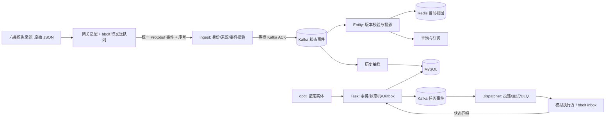

# MeshOps 面试准备（主文档）

> **怎么用这份文档**
> - 面试前 3 天：读第 1—5 节，把 7 条决策记录里的「代价与替换条件」默念一遍。
> - 面试前 1 小时：只看 [速查卡](cheatsheet.md)。
> - 永远不要背这份文档的句子。面试官追问的一定是「为什么」和「什么情况下不成立」，背句子必崩。
> - 所有 `文件:行号` 都可以当场打开给面试官看，这是这个项目最硬的底气。

---

## 0. 开场稿

### 30 秒版

> 我做过一个多源实体实时协同与可靠任务调度的平台。它要解决的问题是：一批物理实体由不同厂商用不同格式上报状态，需要统一接入、统一查询和订阅，并且能在指定实体上可靠地下发巡检任务、跟踪执行结果。我用 Go 写的，八个小程序，中间件是 Kafka、Redis、MySQL，重点全部放在「故障下数据不丢不重」这件事上——比如消费到一半崩溃、执行方断线、消息保留窗口被清掉，这些都有真实跑过的恢复测试。

### 2 分钟版（在 30 秒基础上按顺序补这三段）

1. **数据流**：来源 → 网关（本地持久化队列）→ 统一 Protobuf 事件 → Ingest 校验身份 → Kafka（等 ACK）→ Entity 做版本校验和投影 → Redis 当前视图；同时抽样写 MySQL 历史。任务侧是 opctl 建任务 → Task 服务在一个事务里写任务+审计+Outbox → Dispatcher 投递 → 模拟执行方 → 状态回报。
2. **三个我认为最值得讲的点**：（a）至少一次加消费端幂等，版本和墓碑的判定放在 Redis Lua 里原子完成；（b）位点提交严格晚于副作用，而且 Lag 归零不等于数据完整，保留窗口缺口必须显式失败；（c）边缘侧用 bbolt 做断线补传，远程 ACK 早到而本地没落盘的强杀场景有验证。
3. **边界**：数据源和执行方都是模拟的，本机 Docker Compose，单实例，压测只到 500 events/s——我不声称它是生产级容量。

---

## 1. 项目背景

### 要解决的通用问题

不是「做一个无人机平台」，而是三个通用工程问题：

1. **多源异构接入**：六类实体（人员、无人机、地面车辆、巡检机器人、固定传感器、设施）由不同来源上报，原始格式各不相同（字段名、单位、时间格式、必填缺失的表达方式都不一样）。需要统一成一种事件，并且保证**同一实体只有一个权威来源**，防止两个来源互相覆盖。
2. **实时视图 + 历史**：对外提供状态查询和订阅（先快照后增量），并把状态变化抽样成历史供回查。
3. **可靠任务下发**：操作员选择目标实体下发 inspect 任务，前四类实体可执行、后两类只提供状态；任务要能重试、能取消、能在执行方断线或进程被杀之后仍然只有一个终态，且副作用不重复。

### 为什么做这个

- 想练的不是 CRUD，而是**分布式链路的正确性**：消息重复、乱序、位点、崩溃窗口、保留窗口边界。
- 想练的是**在故障下能自证**：每个结论都有集成测试或故障演练的原始输出，而不是"我测过"。

### 范围裁剪（明确不做）

- 不做路径规划、不做最优资源分配、不做真实设备控制。
- 不引入第二条消息总线，不做双索引在线切换，不做生产级 TLS/密钥托管。
- 用模拟来源和模拟执行方，替代真实硬件。

裁剪本身就是加分项：面试官问"为什么不做 X"，你要答的是"因为我的验证预算要花在故障路径上，而不是功能数量上"。

### 数据经过哪些地方



---

## 2. 项目介绍（一页版）

| 项目 | 内容 |
| --- | --- |
| 名称 | MeshOps 多源实体实时协同与可靠任务调度平台 |
| 形态 | Go module `example.com/meshops-course`，8 个可执行程序 |
| 语言/框架 | Go 1.25.10；gRPC + Protobuf；go-zero（只用 zrpc 装配、conf、proc 生命周期） |
| 中间件 | Kafka 3.7.0（手动提交位点）、Redis 7.2（Lua 原子脚本）、MySQL 8.0（增量迁移 001—004）、bbolt（边缘持久化） |
| 待闭环 | Canal 1.1.8 → ES 8.19.4 的任务搜索读模型（组件已写，装配未完成） |
| 代码量 | 手写业务 9,001 行 / 手写测试 5,991 行（测试占比 40%）；生成代码 6,985 行；共 115 个 .go 文件 |
| 接口面 | 6 个 gRPC 服务 / 14 个 RPC；11 张表（业务主表 4 张） |
| 测试 | 44 个测试文件 / 110 个测试函数；含真实依赖集成、真实进程强杀、故障演练、压测 |

八个程序：`ingest`（接入）、`entity`（投影+订阅+历史）、`task`（任务事实）、`dispatcher`（投递）、`opctl`（操作员 CLI）、`gateway-simulator`（六类来源模拟）、`executor-simulator`（四类执行方模拟）、`verify`（验收工具）。

本机地址：RPC `50051`—`50054`，指标 `18080`—`18083`，MySQL `13306`、Redis `16379`、Kafka `19092`。

---

## 3. 技术选型

每一项都按四列来讲：**选它 / 主要备选 / 为什么在我的约束下选它 / 什么条件下我会换掉它**。第四列是面试官真正想听的。

| 决策 | 选择 | 主要备选 | 选它的理由（我的约束下） | 换掉它的条件 |
| --- | --- | --- | --- | --- |
| 语言 | Go 1.25 | Java/Spring、Rust | 静态类型 + 原生并发 + 单文件部署，适合写"管道和状态机"这类代码；我希望把精力花在正确性而不是框架配置上 | 团队是 Java 生态、要接入已有 Spring 体系时，语言本身不是理由 |
| RPC | gRPC + Protobuf | REST/JSON、Thrift | 有强 schema、有双向流（订阅、执行方拉任务都要流），生成的客户端让 `opctl` 和测试都不用手写协议 | 面向浏览器/第三方开放时，需要在前面加 grpc-gateway 或直接换 REST |
| 框架 | go-zero（只用 zrpc/conf/proc） | 纯 grpc-go、Kratos | 我需要的是进程装配、配置加载、优雅退出的现成件，不想自己造；业务逻辑全部自己写，没有被框架绑住 | 需要服务发现/治理时上 etcd + Kratos；单机场景它已经够用 |
| 消息 | Kafka + 手动提交位点 | RabbitMQ、RocketMQ、Pulsar | 需要真正的分区内顺序、保留窗口语义、可回放、以及"提交点由我决定"的能力——这几条决定了正确性叙事能不能讲 | 只需要任务队列、不需要回放和顺序时，RabbitMQ 更省事 |
| Kafka 客户端 | segmentio/kafka-go | confluent-kafka-go（cgo）、Sarama | 纯 Go 无 cgo，交叉编译和 CI 都省事；`Generation`/`CommitOffsets` 能直接表达"代际围栏" | 需要事务/精确一次或超高吞吐时换 confluent 客户端 |
| 当前视图 | Redis + Lua | 进程内 map、Memcached | 需要跨进程共享 + "比较版本和写入必须原子"；Lua 让跨进程原子性成为可能，而 Go 里先读后写做不到 | 视图能被单进程独占时可退回内存；需要持久化保证时 Redis 要开 AOF/换存储 |
| 事实库 | MySQL 8（行锁 + 唯一约束） | PostgreSQL、TiDB | 任务、审计、Outbox 需要**同事务**，幂等键需要**唯一约束**；这两个需求直接决定了必须是关系库 | 单表写入成为瓶颈时先分区/分库，再考虑分布式数据库 |
| 边缘持久化 | bbolt | SQLite、本地文件、Badger | 边缘模拟器断网时不能依赖中心；bbolt 单文件、无服务端、有 ACID 事务、单进程独占写——和"本地持久化缓冲"语义完全吻合 | 需要多进程共享或复杂查询时换 SQLite |
| 历史存储 | MySQL 抽样表 | 时序库、ClickHouse | 历史是"抽样"不是全量，量级可控；放在同一个 MySQL 里可以跟任务数据做联合查询，省一个中间件 | 采样量级到亿级、需要聚合分析时上 ClickHouse |
| 搜索 | Canal CDC → Kafka → ES | 双写 ES、定时扫表、MySQL LIKE | 我不想让写链路依赖搜索可用性；CDC 让 ES 成为**可重建的只读投影**，"事实源只有一个"这条才成立 | Canal 运维成本高时换 Debezium；纯日志场景可直接用 Kafka Connect |
| 本地编排 | Docker Compose + PowerShell 脚本 | Makefile、k8s | 单机可复现、启动前会校验端口占用和进程身份；k8s 对课程/演示是过度工程 | 多实例、需要滚动升级时上 k8s |
| 分页 | HMAC 签名游标（keyset） | offset 分页、缓存游标 | offset 深翻页有性能和数据漂移问题；签名游标能同时绑定租户和过滤条件，防越权翻页 | 需要"跳到第 N 页"的产品需求时，得另做一套 |

---

## 4. 核心决策记录（ADR）

每条三句话：**我面对的问题 → 我选了什么 → 代价是什么、什么条件下换掉**。最后附证据和常见追问。

### ADR-1　至少一次 + 消费端幂等，不追求精确一次

- **问题**：状态事件从网关到 Kafka 到投影，链路里任何一环崩溃都会导致重复或丢失。Kafka 只能给"至少一次"。
- **选择**：接受至少一次，把幂等做在业务侧：每个事件带 `event_id` 和 `entity_version`；投影用 Redis Lua 一次判完——旧版本忽略、同版本同内容视为重复、同版本不同内容报冲突。
- **代价与替换条件**：代价是消费端必须写幂等逻辑，而且"同版本不同内容"必须报错而不是静默覆盖（否则重复投递会掩盖数据问题）。如果将来真的需要精确一次，正确做法是让副作用本身幂等，而不是去用 Kafka 事务——跨系统的精确一次是伪命题。

**证据**：`internal/state/entity.go:26`（Lua 脚本 `applyView`）、`internal/bus/kafka.go:158-170`（只有 handler 成功后才 `CommitOffsets`，提交的是 `m.Offset+1`）。
**常见追问**："重复投递会不会把新状态覆盖成旧的？"→ 不会，版本比较在同一个 Lua 原子执行里，旧版本直接返回 -1；"同版本不同内容怎么办？"→ 返回冲突错误，因为这说明上游有两个不同的写者，是必须暴露的问题。

### ADR-2　用 Outbox，不用双写、也不用分布式事务

- **问题**："返回创建成功，但事件没发出去"是最典型的静默数据丢失。往 MySQL 和 Kafka 各写一次（双写）必然有崩溃窗口。
- **选择**：任务创建时，在**同一个 MySQL 事务**里写任务行、审计记录、Outbox 事件；另有一个投递器把 Outbox 事件发到 Kafka，发成功后再标记。搜索侧同理，Task 服务完全不依赖 ES。
- **代价与替换条件**：代价是引入了一个投递器、延迟（毫秒级）和"至少一次"（所以要配幂等）。换成事务性消息（如 RocketMQ 事务消息）的前提是团队已经在用那个中间件；否则 Outbox 是成本最低、最容易讲清边界的方案。

**证据**：`internal/tasks/service.go:147-152`（`BeginTx` 后同事务写任务和 Outbox）、`internal/tasks/dispatch_worker.go`（租约 + 重试 + DLQ）。
**常见追问**："Outbox 会不会重复发？"→ 会，所以消费端按业务键幂等；"发成功但标记失败呢？"→ 会重发同 `event_id`，这是被测试覆盖过的场景。

### ADR-3　版本/墓碑判定必须放进 Redis Lua

- **问题**：两个投影消费者并发处理同一实体的不同版本时，Go 层"先读版本、再写状态"之间存在窗口，旧版本可能覆盖新版本；用分布式锁又太重，而且锁超时会带来新的正确性问题。
- **选择**：把"比较 + 写入 + 墓碑标记"整体作为一段 Lua 脚本交给 Redis 执行，天然原子。删除用墓碑而不是物理删除，避免"删掉之后旧事件又把实体复活"。
- **代价与替换条件**：代价是逻辑写在 Lua 里，调试和单测比 Go 麻烦（所以我把判定结果做成了明确的整数返回值，并在测试里逐项断言）。如果视图将来能被单个进程独占，这段逻辑可以退回 Go + 本地锁。

**证据**：`internal/state/entity.go:26`（`applyView`）；测试断言返回值 `1/0/-1/-2` 与墓碑无 TTL。
**常见追问**："为什么不用 Redis 的 WATCH/MULTI？"→ 事务里不能根据读到的值做分支，Lua 可以，而且一次往返。

### ADR-4　边缘侧用 bbolt 做本地持久化缓冲

- **问题**：来源和执行方是"边缘"角色，断网时不能依赖中心数据库；但"进程被杀"时又不能丢已经产生/已执行的数据。
- **选择**：两端各一个 bbolt 文件。来源侧是**待发送队列**（实体版本分配 + 入队放在同一个写事务里，只推进"已确认水位"）；执行方侧是**持久 inbox**（命令、幂等键、取消墓碑、执行结果先落盘再回报）。
- **代价与替换条件**：代价是 bbolt 单进程独占写，多进程共享要换方案；容量硬上限（10 万条 / 1 GiB），满了拒绝写入而不是丢事件。文档里我明确要求"统一称它为本地持久化缓冲，不许包装成自研 WAL"——因为它的持久化保证来自 bbolt，不是我的代码。
- **替换条件**：需要多进程或复杂查询时换 SQLite。

**证据**：`internal/edge/queue.go:24-29`（三个 bucket + 容量上限）、`:122-173`（启动时全量自检，损坏就拒绝启动并保留原文件）、`:300-323`（ACK 只推进已发送区间内的水位）、`internal/edge/inbox.go:290`（先落结果再回报）、`:338-395`（离线压缩前后逐键比对）。
**常见追问**："远程 ACK 到了但本地还没提交，进程被杀会怎样？"→ 事件仍在 pending 里，重启后重发且 `event_id`/版本不变，这条有真实强杀测试。

### ADR-5　任务分发用 MySQL 租约 + `FOR UPDATE SKIP LOCKED`

- **问题**：多个投递器实例（或同一实例的多个 worker）会并发抢同一批待投递任务；同时"投递成功"和"标记成功"之间会崩溃。
- **选择**：待投递行上用 `FOR UPDATE SKIP LOCKED` 取一条并打上租约（`lease_owner`/`lease_until`），租约到期自动可被重新领取；投递重试有次数上限，超限进 DLQ。重复投递由执行方的持久幂等键 + `attempt` 语义兜住。
- **代价与替换条件**：代价是依赖 MySQL 行锁，高竞争下会成为热点；租约到期时间需要权衡（太长则故障恢复慢，太短则重复投递变多）。如果投递量级远超单库承载，再考虑用队列代替轮询。

**证据**：`internal/tasks/dispatch_worker.go:39`（`SKIP LOCKED` + 租约条件）、`:47`（打租约）、`:53-63`（释放与退避）。
**常见追问**："为什么不用 Redis 分布式锁？"→ 锁解决的是互斥，不是"投递恰好一次"；而且锁和任务事实不在同一个事务里，崩溃后的状态推断更难。用行锁 + 租约，恢复逻辑就是一条 SQL。

### ADR-6　搜索走 CDC，不让写链路依赖搜索

- **问题**：任务需要按备注/取消原因/失败原因做全文检索，但搜索不能成为写链路的依赖，也不能出现"MySQL 和 ES 不一致"这种无法自证的状态。
- **选择**：MySQL binlog → Canal（flat JSON）→ 独立单分区 Kafka topic → Search 内索引消费者 → ES。ES 文档只保存**白名单字段**，用 `status_version+1` 作为 external version；全量导入先在短写锁内确定 binlog 起点和一致性读视图，再释放锁。搜索不可用时明确返回错误，**不偷偷降级成 MySQL LIKE**。
- **代价与替换条件**：代价是最终一致（毫秒到秒级），以及多了一个 Canal 的运维面。替换条件：团队已有 Debezium/Kafka Connect 生态时换掉 Canal；数据量小、实时性要求低时，定时增量扫表也能接受（但"可重建"和"不依赖写链路"这两条要保住）。

**证据**：`internal/search/cdc.go`（白名单投影、拒绝 DELETE/DDL）、`internal/search/index.go:86-105`（external version，409 要二次读取内容再判定是重复还是冲突）、`internal/search/query.go:114`（游标绑定租户/筛选/PIT）、`internal/search/snapshot.go:70-82`（锁内建读视图，释放锁后再落起点）。
**常见追问**："为什么用 `status_version+1` 而不是时间戳做版本？"→ 时间戳在同一毫秒内不单调，也依赖机器时钟；业务版本号是可比较的、单源的。**注意**：这条链路目前组件已写、装配未完成，要如实说。

### ADR-7　历史用抽样 + 签名游标分页

- **问题**：状态每秒上报两次、十个来源，如果每条都写历史，MySQL 写入量会被放大几十倍，而回查需求其实只看"轨迹"。
- **选择**：按规则抽样（首次样本、状态变化、位置变化、速度/航向变化、时间周期），同一事件只留一个命中原因；分页用 `occurred_at + id` 排序的 keyset 游标，游标用 HMAC 签名并绑定租户、过滤条件、首采时间上界和有效期。
- **代价与替换条件**：代价是历史不保证"每次上报都有一行"，这是要主动说明的语义；另外过期样本需要清理任务（我用有预算的分页清理）。如果将来要完整时序，应该另建时序库而不是把抽样表变成全量表。

**证据**：`internal/tasks/queries.go:31-48`（HMAC 签名 + 全字段绑定校验）、`internal/state/history.go`（抽样规则与清理）、迁移 `004_history_retention_indexes.sql`。
**常见追问**："同一个时间戳的多条记录怎么翻页？"→ 用 `(occurred_at, id)` 双字段；只按时间翻会漏或重复。

---

## 5. 实测数据（本机记录，可复现）

> 来源：仓库 `verification/2026-09-10/`（我本人未重跑，因为本机 Docker 被沙箱限制；面试时如实说明"这是本机 Docker Compose 环境下的实测记录"）。

**环境**：i7-14650HX（16 核 24 线程）、约 31.6 GiB 内存、Windows 11、Go 1.25.10，本地 Docker 里的 Kafka 3.7.0 / Redis 7.2-alpine / MySQL 8.0。

| 提供负载 | 接受条数 | 实际接受速率 | 客户端→Kafka ACK p99 | 抽样可见延迟 p99 |
| --- | ---: | ---: | ---: | ---: |
| 100 条/秒 | 3,000 | 99.89 条/秒 | 6.033 ms | 24.329 ms |
| 500 条/秒 | 15,000 | 498.90 条/秒 | 3.934 ms | 78.209 ms |

上报错误、队列丢弃、观测遗漏均为 0；状态投影与历史消费 Lag 最终为 0；编码消息 p99 为 289 字节；最高档结束时两服务 Go 活跃堆约 16.73 / 14.66 MiB。

**故障恢复实测**（从开始恢复操作到功能恢复）：

| 故障 | 观测 | 恢复耗时 |
| --- | --- | ---: |
| Kafka 停机 | 发布未被确认（不返回虚假成功） | 34.088 s |
| Redis 停机 | 查询返回 UNAVAILABLE，Kafka 保留待投影事件 | 3.936 s |
| MySQL 停机 | 任务查询 UNAVAILABLE，恢复后读到原任务 | 4.376 s |
| Entity 进程强杀 | 查询不可用，恢复后追上停机期间事件 | 27.966 s |

其它已有记录：133 个集成测试条目全部通过、0 失败 0 具名跳过；Linux `go test -race ./...` 通过（该轮未接外部依赖）；影子重建用真实 `DeleteRecords` 验证"数据被清掉后明确报告不完整"。

**口径纪律**（这三句必须背下来）：这些数字**不代表系统容量上限**，**不覆盖订阅扇出、网关磁盘吞吐和任务执行性能**，**压测是给定的负载档位而不是压出来的极限**。

---

## 6. 已知边界与不足（诚实清单）

面试官问"这个项目有什么问题"，答得越具体越加分。以下是我复核时确认过的：

### 结构性的（不该用代码去补，要讲清楚）

1. 数据源和执行方都是模拟的，没有真实设备协议、弱网、厂商差异。
2. 单实例、本机 Docker Compose；重平衡、跨机时钟、网络分区只能讲原理。
3. 无 TLS、无用户体系，凭证是机器令牌（32 字节随机 + SHA256 查找 + 常量时间比较）；文档里明确写了"这不是人类密码方案，上生产第一步是 TLS 和密钥托管"。
4. 没有前端，演示靠 CLI 与 JSON 证据。

### 还没做完的（我明确知道，且知道怎么补）

5. **搜索链路未装配**：`internal/search/` 组件和测试都在，但没有任何进程入口、配置、消费者或 `opctl` 子命令引用它，`Service.Ready` 永远为 nil，RPC 恒返回 Unavailable。缺 Canal 复制账户与 binlog 起点注入、首次导入的完成标记、失败重放入口。
6. **任务回报只校验绑定字段**（`internal/tasks/service.go:286`），没有校验该 dispatch 是否真的投递过（`dispatcher.go:283-305` 对 `pending` 的行也返回成功）——这是我下一步要修的。
7. **投影没有启用严格消费**：`ConsumeStrict` 已实现（`internal/bus/kafka.go:48-53`）但生产路径零调用，`Entity.Run` 用的是遇保留缺口就跳过的宽容模式（`internal/state/entity.go:324-334`），而且 `Consumer` 接口只暴露了 `Consume`。
8. **Kafka 消费有三条静默路径**：`consumePartition` 无返回值（`kafka.go:91`）、`SetOffset` 失败裸 return（`:129-131`）、`firstOffset` 失败只重试不记录（`:106-113`）；handler 失败是无限重试，没有上界也没有 DLQ（`:149-157`），毒消息会永久占住一个分区。
9. **CI 的竞态检测没覆盖并发最重的路径**：`state`/`bus`/`edge` 的集成测试靠环境变量跳过而没有 build tag，而 `go test -race` 排在依赖启动之前，真正连真实依赖的那一步又不带 `-race`。
10. **整个工程尚未提交 Git**（新工程的 928 个文件还是未跟踪状态）。

### 如果你被问"你觉得最该先修哪个"

> 先修第 6 条（回报要校验投递事实），因为它是核心链路里唯一一个真正的正确性漏洞；然后补搜索装配。第 7、8 条属于"承诺没有接线"，我已经定位到具体行，但需要改接口，排在后面。

---

## 7. 高频面试问题与参考答案

### 7.1 项目类

**Q1：这个项目最难的地方是什么？**
答：难点不在功能，而在"证明它在故障下是对的"。比如"投递成功但标记失败"这个窗口——你不能只测正常流程，得在真实 Kafka ACK 之后把进程强杀，再验证重启后重发的是同一个 `event_id`。这类测试要自己造故障点、自己判断"什么算通过"，比写业务代码难得多。

**Q2：为什么只有前四类实体能执行任务？**
答：那是领域约束：人员、无人机、地面车辆、机器人可以移动、能执行 inspect；固定传感器和设施只提供状态。状态类实体收到任务要返回 `FAILED_PRECONDITION`，而且不能留下任务/历史/Outbox 记录——这条有专门的测试。

**Q3：一个实体有两个来源同时上报怎么办？**
答：领域上每个实体只绑定一个权威来源，注册信息在 `configs/` 里。Ingest 会校验来源身份与绑定，非权威来源的上报被拒绝。

### 7.2 正确性 / 分布式类

**Q4：消息重复了怎么办？**
答：分三层。投影层用 `event_id` + `entity_version` 在 Redis Lua 里原子判定，旧版本忽略、同版本同内容视为重复；任务回报层用 `task_execution_reports` 的 `event_id` 请求哈希去重；执行方用持久幂等键保证同一条命令只产生一次副作用（`effect_count=1` 在演示里是逐任务校验的）。

**Q5：位点提交点为什么选在那里？消费到一半崩溃会怎样？**
答：提交严格晚于 handler 成功，提交的是 `offset+1`（`internal/bus/kafka.go:158-170`）。崩溃会导致重放未提交的部分，所以上一条的幂等是前提。反过来如果先提交后处理，崩溃就是静默丢数据——两害相权，重复可修，丢失不可修。

**Q6：为什么不用 exactly-once / Kafka 事务？**
答：因为我的副作用不只在 Kafka 里——要写 Redis、MySQL、还有执行方的本地文件。Kafka 事务只能覆盖 Kafka 内部的读写，跨系统仍然是至少一次。所以正确解法是把每个副作用做成幂等的，而不是追求一个跨系统的"精确一次"。这也是我把"至少一次 + 幂等"写进设计文档的原因。

**Q7：Lag 归零能不能说明数据完整？**
答：不能，这是我在这个项目里最想强调的一点。如果 Kafka 因保留策略删掉了旧消息，消费者从保留的第一个偏移量开始读，Lag 照样会归零，但中间那段事实已经永久丢了。所以重建要求一份**独立的期望清单**，对不上就拒绝切换（`internal/state/rebuild.go:75` `VerifyGeneration`、`:97` `Rebuild`）；消费侧也记录了保留缺口，而不是把它当健康。

**Q8：慢消费者会不会拖垮服务？**
答：订阅侧每个 RPC 一个独立 sender goroutine，有双超时和条数/字节上界；有一条测试用真实 HTTP/2 流控把窗口耗尽，断言"被阻塞的 SendMsg 能退出、健康流的客户端不受影响"。

**Q9：多租户怎么做隔离的？**
答：租户来自**可信身份**（认证上下文），不从请求参数取；SQL 全部参数化；列表游标用 HMAC 签名并绑定租户、过滤条件、页大小、时间上界和有效期，拿别人的 token 换实体或换条件会被拒绝。

**Q10：如果流量涨 10 倍，你先改哪里？**
答：按瓶颈顺序：先把 Ingest/Entity 的消费者并发和分区数一起扩（分区内顺序不能丢，所以是加分区不是加线程）；然后给 Redis 投影加批量管道；历史抽样的写入量是随负载线性涨的，得把清理和写入节奏重新算预算；最后才是 MySQL 的任务写入分片。我不会一上来就换中间件——先做容量测量，再决定是不是架构问题。

### 7.3 "这是你写的吗"（必须准备）

**Q11：这个项目是你自己写的吗？**
> 整体设计和这版代码是在 AI 助手协助下完成的，教学材料也是。我负责定边界、做选型、判断哪些测试算通过，以及逐处核对不变量——比如"投影必须用严格消费"这条，就是我发现代码里 `ConsumeStrict` 写了但生产路径没接线之后提出来要改的；还有回报不校验投递事实那个漏洞，也是复核时定位到具体行的。所以任意一处你都可以问我：为什么这么设计、代价是什么、现在还有什么没做完。

**Q12：AI 写的代码你怎么确认是对的？**
答：四点。一是所有结论都要有真实依赖的测试或故障演练输出，不接受"看起来对"；二是关键不变量我会去读实现确认，不采信注释和文档；三是文档里专门有一节写"不能从本轮结果推出什么"，把没证明的部分标出来；四是我会主动找反例——比如保留窗口被清空后重建会不会假装成功、同版本不同内容会不会被静默覆盖。

### 7.4 岗位与取舍类

**Q13：为什么用 Go 而不是 Java？**
答：这个项目的主体是数据管道和状态机，Go 的静态类型、原生并发模型和单文件部署让"把精力放在正确性上"更容易。但这不构成对 Java 的判断——如果岗位是 Java 生态，我可以很快迁移过去，分布式正确性的部分（位点、幂等、事务边界、租约）跟语言无关。

**Q14：为什么不做真实设备接入？**
答：投入产出比。真实设备接入的价值在于协议适配和弱网处理，但那需要硬件和长时间联调；我把同样的时间投在了故障路径的验证上。如果要做，我会先加一个"来源适配层"的契约测试，用录制回放代替真实设备。

**Q15：这个项目的业务价值是什么？**
答：作为课程项目，它的价值是**证明我能把一条分布式链路的正确性讲清楚并验证**，而不是业务指标。真实的同类系统在工业巡检、园区安防里都有：多源状态接入 + 任务调度。我不会把它包装成有用户的线上系统。

### 7.5 底层基础（项目里能自然带出来的）

**Q16：bbolt 为什么适合这里？**
答：单文件、B+ 树、mmap 读、ACID 事务、单进程独占写。边缘模拟器断网时不能依赖中心，所以需要的是"本地事务文件"，而不是客户端-服务端数据库。代价是单写者，所以我把"版本分配 + 入队"放进同一个写事务，避免出现"版本被消耗但事件丢了"。

**Q17：Kafka 分区和顺序的关系？**
答：同一实体的事件用 `tenant_id + entity_id` 做 key，保证落在同一分区、分区内有序——但只要分区数大于 1，就不能说全局有序。跨实体的顺序我不依赖。

**Q18：Redis 挂了会怎样？**
答：查询返回 UNAVAILABLE（不能把"查不到"伪装成"不存在"），Kafka 侧继续保留待投影事件，恢复后重放；有专门测 OOM 场景下**位点不前进**的用例。实测 Redis 停机恢复 3.936 秒。

**Q19：你怎么防止"消费者重平衡时处理到一半"？**
答：提交用 `Generation` 做代际围栏，遇到 `IllegalGeneration`/`UnknownMemberId`/`RebalanceInProgress` 直接退出该分区 worker（`internal/bus/kafka.go:164-166`），让新 owner 从头接管未提交的部分，靠幂等兜住重复。

**Q20：你项目里最不成熟的地方是哪里？**
答：搜索那条链路和错误可观测性。搜索的组件写完了但没装配（没有进程、没有配置、没有消费者），我不会说它"已完成"；另外 Kafka 消费里有几处失败路径只重试不记录，长期运行会变成静默停摆——这些是我的待办，我清楚地知道它们在哪几行。

---

## 8. 反问面试官的问题

- 团队现在最痛的稳定性问题是哪一类：容量、数据一致性，还是故障恢复？
- 这个岗位每天写的代码，更多是业务逻辑还是基础设施？半年后希望我独立负责哪一块？
- 团队的代码评审里，什么样的技术方案会被认为"考虑周全"？
- 如果我入职，第一个月最可能接触到的线上问题会是什么类型的？

---

## 9. 简历怎么写

### 项目条目（可直接用）

> **MeshOps 多源实体实时协同与可靠任务调度平台**（个人项目 / Go）
> - 设计并实现六类异构来源的统一接入链路：网关侧本地持久化待发送队列 → Protobuf 事件 → Ingest 身份与来源校验 → Kafka，采用**至少一次投递 + 消费端幂等**（Redis Lua 原子完成版本/墓碑判定），在真实 Kafka/Redis/MySQL 上完成 100/500 events/s 两档压测，客户端至 Kafka ACK 的 P99 为 6.0/3.9 ms。
> - 用**同事务 Outbox** 解决"返回成功但事件未发布"的静默丢失；任务分发采用 MySQL 租约 + `FOR UPDATE SKIP LOCKED` + 有界重试与 DLQ，重复投递由执行方持久幂等键兜住。
> - 边缘网关以 bbolt 实现断线补传队列与执行方持久 inbox，通过**真实进程强杀**验证"远程已 ACK、本地未提交"等崩溃窗口下不丢不重（重放后 pending=0、`effect_count=1`）。
> - 建立故障演练与性能验收：Kafka/Redis/MySQL 停机与 Entity 强杀四类故障的恢复耗时分别为 34.1/3.9/4.4/28.0 秒；影子重建以独立期望清单校验，缺失时拒绝切换，明确"Lag 归零不等于数据完整"。
> - 手写 Go 约 1.5 万行（测试占 40%），含 110 个测试函数与真实依赖集成测试；增量迁移 001—004，CI 覆盖构建、vet、静态检查与竞态检测。

### 三条口径纪律

1. 写"至少一次 + 消费端幂等"，**绝不写 exactly-once**；写"分区内有序"，不写全局有序。
2. 写"本机 Docker Compose 故障演练"，不写"高可用"；写实测数字，不写"高并发"。
3. 写"模拟来源与模拟执行方"，不写真实设备控制。

---

## 附：复现入口

```powershell
./scripts/initialize.ps1          # 启动 Compose、构建八个程序、执行 001—004 迁移
./scripts/start.ps1 -Simulators   # 四个服务 + 六个来源模拟器 + 四个执行方
./scripts/demo.ps1                # 六类查询、四类任务、幂等创建、真实订阅
./scripts/test.ps1 -Integration   # 真实依赖集成测试
./scripts/faults.ps1              # 故障演练
./scripts/benchmark.ps1 -Seconds 30
```

演示与验收的原始输出在 `results/` 与 `verification/2026-09-10/`。
