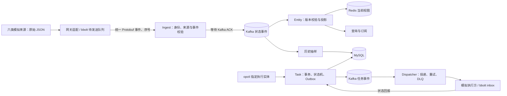

# Z09 完整文件清单与复制答案

本页由阶段源码生成，验证范围以课程工作记录为准。每个代码块都是该路径的完整文件，覆盖时整份替换；不要把 Markdown 围栏写进源文件。所有相对路径均以同一个学习目录为根。文件创建到一半时暂时不能编译是正常的，阶段清单完成后再进行本阶段运行检查。

手工路线：先停止上阶段服务；备份需要移除的旧文件到工程外，再移除清单列出的单个文件；按本页创建或替换文件。未列为变化的文件保留。受管理路线使用 apply-checkpoint.ps1，它完成相同的阶段文件变化；不要在没有阶段记录的手工目录调用它。

## 移除的旧文件

无。

## 本阶段全部文件

| 路径 | 操作 | 完整原文件 |
| --- | --- | --- |
| `.gitignore` | 替换 | [完整文件](../../business-stages/z09/.gitignore) |
| `cmd/dispatcher/main.go` | 替换 | [完整文件](../../business-stages/z09/cmd/dispatcher/main.go) |
| `cmd/entity/main.go` | 替换 | [完整文件](../../business-stages/z09/cmd/entity/main.go) |
| `cmd/executor-simulator/main.go` | 保留 | [完整文件](../../business-stages/z09/cmd/executor-simulator/main.go) |
| `cmd/gateway-simulator/main.go` | 保留 | [完整文件](../../business-stages/z09/cmd/gateway-simulator/main.go) |
| `cmd/ingest/main.go` | 替换 | [完整文件](../../business-stages/z09/cmd/ingest/main.go) |
| `cmd/opctl/main.go` | 替换 | [完整文件](../../business-stages/z09/cmd/opctl/main.go) |
| `cmd/task/main.go` | 替换 | [完整文件](../../business-stages/z09/cmd/task/main.go) |
| `cmd/verify/main_test.go` | 创建 | [完整文件](../../business-stages/z09/cmd/verify/main_test.go) |
| `cmd/verify/main.go` | 创建 | [完整文件](../../business-stages/z09/cmd/verify/main.go) |
| `configs/dispatcher.yaml` | 保留 | [完整文件](../../business-stages/z09/configs/dispatcher.yaml) |
| `configs/entity.yaml` | 保留 | [完整文件](../../business-stages/z09/configs/entity.yaml) |
| `configs/ingest.yaml` | 保留 | [完整文件](../../business-stages/z09/configs/ingest.yaml) |
| `configs/simulation.yaml` | 保留 | [完整文件](../../business-stages/z09/configs/simulation.yaml) |
| `configs/task.yaml` | 保留 | [完整文件](../../business-stages/z09/configs/task.yaml) |
| `docker-compose.yml` | 保留 | [完整文件](../../business-stages/z09/docker-compose.yml) |
| `gen/common/v1/entity.pb.go` | 保留 | [完整文件](../../business-stages/z09/gen/common/v1/entity.pb.go) |
| `gen/common/v1/task.pb.go` | 保留 | [完整文件](../../business-stages/z09/gen/common/v1/task.pb.go) |
| `gen/dispatcher/v1/dispatcher_grpc.pb.go` | 保留 | [完整文件](../../business-stages/z09/gen/dispatcher/v1/dispatcher_grpc.pb.go) |
| `gen/dispatcher/v1/dispatcher.pb.go` | 保留 | [完整文件](../../business-stages/z09/gen/dispatcher/v1/dispatcher.pb.go) |
| `gen/entity/v1/entity_grpc.pb.go` | 保留 | [完整文件](../../business-stages/z09/gen/entity/v1/entity_grpc.pb.go) |
| `gen/entity/v1/entity.pb.go` | 保留 | [完整文件](../../business-stages/z09/gen/entity/v1/entity.pb.go) |
| `gen/executor/v1/executor_grpc.pb.go` | 保留 | [完整文件](../../business-stages/z09/gen/executor/v1/executor_grpc.pb.go) |
| `gen/executor/v1/executor.pb.go` | 保留 | [完整文件](../../business-stages/z09/gen/executor/v1/executor.pb.go) |
| `gen/ingest/v1/ingest_grpc.pb.go` | 保留 | [完整文件](../../business-stages/z09/gen/ingest/v1/ingest_grpc.pb.go) |
| `gen/ingest/v1/ingest.pb.go` | 保留 | [完整文件](../../business-stages/z09/gen/ingest/v1/ingest.pb.go) |
| `gen/task/v1/task_grpc.pb.go` | 保留 | [完整文件](../../business-stages/z09/gen/task/v1/task_grpc.pb.go) |
| `gen/task/v1/task.pb.go` | 保留 | [完整文件](../../business-stages/z09/gen/task/v1/task.pb.go) |
| `go.mod` | 保留 | [完整文件](../../business-stages/z09/go.mod) |
| `go.sum` | 保留 | [完整文件](../../business-stages/z09/go.sum) |
| `internal/app/health_test.go` | 保留 | [完整文件](../../business-stages/z09/internal/app/health_test.go) |
| `internal/app/health.go` | 保留 | [完整文件](../../business-stages/z09/internal/app/health.go) |
| `internal/app/run.go` | 替换 | [完整文件](../../business-stages/z09/internal/app/run.go) |
| `internal/bus/kafka_test.go` | 保留 | [完整文件](../../business-stages/z09/internal/bus/kafka_test.go) |
| `internal/bus/kafka.go` | 保留 | [完整文件](../../business-stages/z09/internal/bus/kafka.go) |
| `internal/bus/lag_test.go` | 保留 | [完整文件](../../business-stages/z09/internal/bus/lag_test.go) |
| `internal/bus/lag.go` | 保留 | [完整文件](../../business-stages/z09/internal/bus/lag.go) |
| `internal/bus/retention_test.go` | 保留 | [完整文件](../../business-stages/z09/internal/bus/retention_test.go) |
| `internal/bus/retention.go` | 保留 | [完整文件](../../business-stages/z09/internal/bus/retention.go) |
| `internal/cli/opctl_test.go` | 保留 | [完整文件](../../business-stages/z09/internal/cli/opctl_test.go) |
| `internal/cli/opctl.go` | 保留 | [完整文件](../../business-stages/z09/internal/cli/opctl.go) |
| `internal/edge/cli_test.go` | 保留 | [完整文件](../../business-stages/z09/internal/edge/cli_test.go) |
| `internal/edge/cli.go` | 保留 | [完整文件](../../business-stages/z09/internal/edge/cli.go) |
| `internal/edge/crash_test.go` | 保留 | [完整文件](../../business-stages/z09/internal/edge/crash_test.go) |
| `internal/edge/executor_test.go` | 保留 | [完整文件](../../business-stages/z09/internal/edge/executor_test.go) |
| `internal/edge/executor.go` | 保留 | [完整文件](../../business-stages/z09/internal/edge/executor.go) |
| `internal/edge/inbox_test.go` | 保留 | [完整文件](../../business-stages/z09/internal/edge/inbox_test.go) |
| `internal/edge/inbox.go` | 保留 | [完整文件](../../business-stages/z09/internal/edge/inbox.go) |
| `internal/edge/queue_test.go` | 保留 | [完整文件](../../business-stages/z09/internal/edge/queue_test.go) |
| `internal/edge/queue.go` | 保留 | [完整文件](../../business-stages/z09/internal/edge/queue.go) |
| `internal/edge/retire_report_test.go` | 保留 | [完整文件](../../business-stages/z09/internal/edge/retire_report_test.go) |
| `internal/edge/runtime_test.go` | 保留 | [完整文件](../../business-stages/z09/internal/edge/runtime_test.go) |
| `internal/edge/simulation.go` | 保留 | [完整文件](../../business-stages/z09/internal/edge/simulation.go) |
| `internal/edge/terminal_recovery_test.go` | 保留 | [完整文件](../../business-stages/z09/internal/edge/terminal_recovery_test.go) |
| `internal/edge/uplink_test.go` | 保留 | [完整文件](../../business-stages/z09/internal/edge/uplink_test.go) |
| `internal/edge/uplink.go` | 保留 | [完整文件](../../business-stages/z09/internal/edge/uplink.go) |
| `internal/platform/auth.go` | 保留 | [完整文件](../../business-stages/z09/internal/platform/auth.go) |
| `internal/platform/config.go` | 保留 | [完整文件](../../business-stages/z09/internal/platform/config.go) |
| `internal/platform/cursor.go` | 保留 | [完整文件](../../business-stages/z09/internal/platform/cursor.go) |
| `internal/platform/platform_test.go` | 保留 | [完整文件](../../business-stages/z09/internal/platform/platform_test.go) |
| `internal/platform/registry.go` | 保留 | [完整文件](../../business-stages/z09/internal/platform/registry.go) |
| `internal/platform/types.go` | 保留 | [完整文件](../../business-stages/z09/internal/platform/types.go) |
| `internal/state/adapters_test.go` | 保留 | [完整文件](../../business-stages/z09/internal/state/adapters_test.go) |
| `internal/state/adapters.go` | 保留 | [完整文件](../../business-stages/z09/internal/state/adapters.go) |
| `internal/state/crash_test.go` | 保留 | [完整文件](../../business-stages/z09/internal/state/crash_test.go) |
| `internal/state/entity.go` | 保留 | [完整文件](../../business-stages/z09/internal/state/entity.go) |
| `internal/state/history_integration_test.go` | 保留 | [完整文件](../../business-stages/z09/internal/state/history_integration_test.go) |
| `internal/state/history.go` | 保留 | [完整文件](../../business-stages/z09/internal/state/history.go) |
| `internal/state/ingest_test.go` | 保留 | [完整文件](../../business-stages/z09/internal/state/ingest_test.go) |
| `internal/state/ingest.go` | 保留 | [完整文件](../../business-stages/z09/internal/state/ingest.go) |
| `internal/state/integration_setup_test.go` | 保留 | [完整文件](../../business-stages/z09/internal/state/integration_setup_test.go) |
| `internal/state/metrics.go` | 保留 | [完整文件](../../business-stages/z09/internal/state/metrics.go) |
| `internal/state/oom_integration_test.go` | 保留 | [完整文件](../../business-stages/z09/internal/state/oom_integration_test.go) |
| `internal/state/rebuild_integration_test.go` | 创建 | [完整文件](../../business-stages/z09/internal/state/rebuild_integration_test.go) |
| `internal/state/rebuild.go` | 创建 | [完整文件](../../business-stages/z09/internal/state/rebuild.go) |
| `internal/state/retention_integration_test.go` | 保留 | [完整文件](../../business-stages/z09/internal/state/retention_integration_test.go) |
| `internal/state/six_rpc_integration_test.go` | 保留 | [完整文件](../../business-stages/z09/internal/state/six_rpc_integration_test.go) |
| `internal/state/state_test.go` | 替换 | [完整文件](../../business-stages/z09/internal/state/state_test.go) |
| `internal/state/subscription_integration_test.go` | 保留 | [完整文件](../../business-stages/z09/internal/state/subscription_integration_test.go) |
| `internal/state/subscription_transport_test.go` | 保留 | [完整文件](../../business-stages/z09/internal/state/subscription_transport_test.go) |
| `internal/state/subscription.go` | 保留 | [完整文件](../../business-stages/z09/internal/state/subscription.go) |
| `internal/state/validation.go` | 保留 | [完整文件](../../business-stages/z09/internal/state/validation.go) |
| `internal/tasks/crash_integration_test.go` | 保留 | [完整文件](../../business-stages/z09/internal/tasks/crash_integration_test.go) |
| `internal/tasks/dispatch_bounds_test.go` | 保留 | [完整文件](../../business-stages/z09/internal/tasks/dispatch_bounds_test.go) |
| `internal/tasks/dispatch_worker.go` | 保留 | [完整文件](../../business-stages/z09/internal/tasks/dispatch_worker.go) |
| `internal/tasks/dispatcher.go` | 保留 | [完整文件](../../business-stages/z09/internal/tasks/dispatcher.go) |
| `internal/tasks/domain_test.go` | 保留 | [完整文件](../../business-stages/z09/internal/tasks/domain_test.go) |
| `internal/tasks/domain.go` | 保留 | [完整文件](../../business-stages/z09/internal/tasks/domain.go) |
| `internal/tasks/integration_latency_test.go` | 保留 | [完整文件](../../business-stages/z09/internal/tasks/integration_latency_test.go) |
| `internal/tasks/integration_more_test.go` | 保留 | [完整文件](../../business-stages/z09/internal/tasks/integration_more_test.go) |
| `internal/tasks/integration_status_test.go` | 保留 | [完整文件](../../business-stages/z09/internal/tasks/integration_status_test.go) |
| `internal/tasks/integration_test.go` | 保留 | [完整文件](../../business-stages/z09/internal/tasks/integration_test.go) |
| `internal/tasks/interfaces.go` | 保留 | [完整文件](../../business-stages/z09/internal/tasks/interfaces.go) |
| `internal/tasks/migrations.go` | 保留 | [完整文件](../../business-stages/z09/internal/tasks/migrations.go) |
| `internal/tasks/queries.go` | 保留 | [完整文件](../../business-stages/z09/internal/tasks/queries.go) |
| `internal/tasks/service.go` | 保留 | [完整文件](../../business-stages/z09/internal/tasks/service.go) |
| `internal/tasks/store.go` | 保留 | [完整文件](../../business-stages/z09/internal/tasks/store.go) |
| `internal/tasks/workers.go` | 保留 | [完整文件](../../business-stages/z09/internal/tasks/workers.go) |
| `internal/testsupport/crash.go` | 保留 | [完整文件](../../business-stages/z09/internal/testsupport/crash.go) |
| `internal/testsupport/kafka.go` | 保留 | [完整文件](../../business-stages/z09/internal/testsupport/kafka.go) |
| `internal/testsupport/process_other.go` | 保留 | [完整文件](../../business-stages/z09/internal/testsupport/process_other.go) |
| `internal/testsupport/process_windows.go` | 保留 | [完整文件](../../business-stages/z09/internal/testsupport/process_windows.go) |
| `internal/verification/benchmark.go` | 创建 | [完整文件](../../business-stages/z09/internal/verification/benchmark.go) |
| `internal/verification/environment.go` | 创建 | [完整文件](../../business-stages/z09/internal/verification/environment.go) |
| `internal/verification/faults.go` | 创建 | [完整文件](../../business-stages/z09/internal/verification/faults.go) |
| `internal/verification/process_other.go` | 创建 | [完整文件](../../business-stages/z09/internal/verification/process_other.go) |
| `internal/verification/process_windows.go` | 创建 | [完整文件](../../business-stages/z09/internal/verification/process_windows.go) |
| `internal/verification/recovery_test.go` | 创建 | [完整文件](../../business-stages/z09/internal/verification/recovery_test.go) |
| `migrations/001_initial_schema.sql` | 保留 | [完整文件](../../business-stages/z09/migrations/001_initial_schema.sql) |
| `migrations/002_framework_contracts.sql` | 保留 | [完整文件](../../business-stages/z09/migrations/002_framework_contracts.sql) |
| `migrations/003_implementation_contracts.sql` | 保留 | [完整文件](../../business-stages/z09/migrations/003_implementation_contracts.sql) |
| `migrations/004_history_retention_indexes.sql` | 保留 | [完整文件](../../business-stages/z09/migrations/004_history_retention_indexes.sql) |
| `proto/buf.yaml` | 保留 | [完整文件](../../business-stages/z09/proto/buf.yaml) |
| `proto/common/v1/entity.proto` | 保留 | [完整文件](../../business-stages/z09/proto/common/v1/entity.proto) |
| `proto/common/v1/task.proto` | 保留 | [完整文件](../../business-stages/z09/proto/common/v1/task.proto) |
| `proto/dispatcher/v1/dispatcher.proto` | 保留 | [完整文件](../../business-stages/z09/proto/dispatcher/v1/dispatcher.proto) |
| `proto/entity/v1/entity.proto` | 保留 | [完整文件](../../business-stages/z09/proto/entity/v1/entity.proto) |
| `proto/executor/v1/executor.proto` | 保留 | [完整文件](../../business-stages/z09/proto/executor/v1/executor.proto) |
| `proto/ingest/v1/ingest.proto` | 保留 | [完整文件](../../business-stages/z09/proto/ingest/v1/ingest.proto) |
| `proto/task/v1/task.proto` | 保留 | [完整文件](../../business-stages/z09/proto/task/v1/task.proto) |
| `README.md` | 替换 | [完整文件](../../business-stages/z09/README.md) |
| `scripts/benchmark.ps1` | 创建 | [完整文件](../../business-stages/z09/scripts/benchmark.ps1) |
| `scripts/build.ps1` | 替换 | [完整文件](../../business-stages/z09/scripts/build.ps1) |
| `scripts/demo.ps1` | 保留 | [完整文件](../../business-stages/z09/scripts/demo.ps1) |
| `scripts/env.ps1` | 保留 | [完整文件](../../business-stages/z09/scripts/env.ps1) |
| `scripts/faults.ps1` | 创建 | [完整文件](../../business-stages/z09/scripts/faults.ps1) |
| `scripts/generate.ps1` | 保留 | [完整文件](../../business-stages/z09/scripts/generate.ps1) |
| `scripts/initialize.ps1` | 保留 | [完整文件](../../business-stages/z09/scripts/initialize.ps1) |
| `scripts/processes.ps1` | 保留 | [完整文件](../../business-stages/z09/scripts/processes.ps1) |
| `scripts/processes.test.ps1` | 保留 | [完整文件](../../business-stages/z09/scripts/processes.test.ps1) |
| `scripts/start.ps1` | 保留 | [完整文件](../../business-stages/z09/scripts/start.ps1) |
| `scripts/stop.ps1` | 保留 | [完整文件](../../business-stages/z09/scripts/stop.ps1) |
| `scripts/test.ps1` | 保留 | [完整文件](../../business-stages/z09/scripts/test.ps1) |
| `scripts/verify-proto.ps1` | 保留 | [完整文件](../../business-stages/z09/scripts/verify-proto.ps1) |
| `testdata/contracts/normalized-expectations.json` | 保留 | [完整文件](../../business-stages/z09/testdata/contracts/normalized-expectations.json) |
| `testdata/migrations/001_existing_task.sql` | 保留 | [完整文件](../../business-stages/z09/testdata/migrations/001_existing_task.sql) |
| `testdata/proto/legacy.bin` | 保留 | [完整文件](../../business-stages/z09/testdata/proto/legacy.bin) |
| `testdata/proto/README.md` | 保留 | [完整文件](../../business-stages/z09/testdata/proto/README.md) |
| `testdata/proto/reference-v1.bin` | 保留 | [完整文件](../../business-stages/z09/testdata/proto/reference-v1.bin) |
| `testdata/sources/drone.json` | 保留 | [完整文件](../../business-stages/z09/testdata/sources/drone.json) |
| `testdata/sources/facility.json` | 保留 | [完整文件](../../business-stages/z09/testdata/sources/facility.json) |
| `testdata/sources/person.json` | 保留 | [完整文件](../../business-stages/z09/testdata/sources/person.json) |
| `testdata/sources/robot.json` | 保留 | [完整文件](../../business-stages/z09/testdata/sources/robot.json) |
| `testdata/sources/sensor.json` | 保留 | [完整文件](../../business-stages/z09/testdata/sources/sensor.json) |
| `testdata/sources/vehicle.json` | 保留 | [完整文件](../../business-stages/z09/testdata/sources/vehicle.json) |
| `verification/2026-09-10/acceptance.md` | 创建 | [完整文件](../../business-stages/z09/verification/2026-09-10/acceptance.md) |
| `verification/2026-09-10/archive-check.json` | 创建 | [完整文件](../../business-stages/z09/verification/2026-09-10/archive-check.json) |
| `verification/2026-09-10/benchmark.json` | 创建 | [完整文件](../../business-stages/z09/verification/2026-09-10/benchmark.json) |
| `verification/2026-09-10/benchmark.stderr.txt` | 创建 | [完整文件](../../business-stages/z09/verification/2026-09-10/benchmark.stderr.txt) |
| `verification/2026-09-10/commands.txt` | 创建 | [完整文件](../../business-stages/z09/verification/2026-09-10/commands.txt) |
| `verification/2026-09-10/demo.json` | 创建 | [完整文件](../../business-stages/z09/verification/2026-09-10/demo.json) |
| `verification/2026-09-10/faults.json` | 创建 | [完整文件](../../business-stages/z09/verification/2026-09-10/faults.json) |
| `verification/2026-09-10/faults.stderr.txt` | 创建 | [完整文件](../../business-stages/z09/verification/2026-09-10/faults.stderr.txt) |
| `verification/2026-09-10/integration.jsonl` | 创建 | [完整文件](../../business-stages/z09/verification/2026-09-10/integration.jsonl) |
| `verification/2026-09-10/integration.stderr.txt` | 创建 | [完整文件](../../business-stages/z09/verification/2026-09-10/integration.stderr.txt) |
| `verification/2026-09-10/linux-race.stderr.txt` | 创建 | [完整文件](../../business-stages/z09/verification/2026-09-10/linux-race.stderr.txt) |
| `verification/2026-09-10/linux-race.txt` | 创建 | [完整文件](../../business-stages/z09/verification/2026-09-10/linux-race.txt) |
| `verification/2026-09-10/machine.json` | 创建 | [完整文件](../../business-stages/z09/verification/2026-09-10/machine.json) |
| `verification/2026-09-10/mod-verify.txt` | 创建 | [完整文件](../../business-stages/z09/verification/2026-09-10/mod-verify.txt) |
| `verification/2026-09-10/process-tests.txt` | 创建 | [完整文件](../../business-stages/z09/verification/2026-09-10/process-tests.txt) |
| `verification/2026-09-10/proto-check.txt` | 创建 | [完整文件](../../business-stages/z09/verification/2026-09-10/proto-check.txt) |
| `verification/2026-09-10/quality.json` | 创建 | [完整文件](../../business-stages/z09/verification/2026-09-10/quality.json) |
| `verification/2026-09-10/readme-walkthrough.txt` | 创建 | [完整文件](../../business-stages/z09/verification/2026-09-10/readme-walkthrough.txt) |
| `verification/2026-09-10/source-sha256.json` | 创建 | [完整文件](../../business-stages/z09/verification/2026-09-10/source-sha256.json) |
| `verification/2026-09-10/staticcheck.txt` | 创建 | [完整文件](../../business-stages/z09/verification/2026-09-10/staticcheck.txt) |
| `verification/2026-09-10/summary.md` | 创建 | [完整文件](../../business-stages/z09/verification/2026-09-10/summary.md) |
| `verification/2026-09-10/verification-tools-tests.txt` | 创建 | [完整文件](../../business-stages/z09/verification/2026-09-10/verification-tools-tests.txt) |
| `verification/2026-09-10/vet.txt` | 创建 | [完整文件](../../business-stages/z09/verification/2026-09-10/vet.txt) |

## 创建或替换的完整内容

### `.gitignore`

<!-- file:.gitignore -->
`````text
# ============================================================================
# Go
# ============================================================================
# 编译产物
/bin/
/dist/
*.exe
*.exe~
*.dll
*.so
*.dylib

# 测试产物
*.test
*.out
coverage.out
coverage.html

# Go workspace
go.work
go.work.sum

# 依赖目录（使用 go modules，不提交 vendor 除非明确需要）
/vendor/

# ============================================================================
# Protobuf 生成代码
# ============================================================================
# 本项目提交 gen/ 下的生成代码，确保新克隆无需安装 protoc/goctl 即可构建。
# 修改 proto 后运行 make proto，并一并提交生成结果。

# ============================================================================
# 配置与密钥（绝不提交）
# ============================================================================
*.env
.env.*
!.env.example
config.local.yaml
config.local.yml
simulation.local.yaml
simulation.local.yml
*-secret.yaml
secrets/
*.pem
*.key
!testdata/**/*.key

# ============================================================================
# 本地数据与运行时
# ============================================================================
# bbolt 数据文件
*.db
*.bolt
/data/

# 压测结果
/benchmark-results/

# 日志
*.log
/logs/

# ============================================================================
# IDE 与工具
# ============================================================================
.idea/
.vscode/
/.cache/
.claude/settings.local.json
.worktrees/
*.swp
*.swo
*~
.DS_Store

# ============================================================================
# Docker
# ============================================================================
# Docker Compose 覆盖文件
docker-compose.override.yml

# Complete application runtime
.local/
bin/
data/
results/
*.test.exe
*.out
`````
<!-- end-file -->

### `cmd/dispatcher/main.go`

<!-- file:cmd/dispatcher/main.go -->
`````go
package main
import "example.com/meshops-course/internal/app"
func main(){app.Main("dispatcher")}
`````
<!-- end-file -->

### `cmd/entity/main.go`

<!-- file:cmd/entity/main.go -->
`````go
package main
import "example.com/meshops-course/internal/app"
func main(){app.Main("entity")}
`````
<!-- end-file -->

### `cmd/ingest/main.go`

<!-- file:cmd/ingest/main.go -->
`````go
package main
import "example.com/meshops-course/internal/app"
func main(){app.Main("ingest")}
`````
<!-- end-file -->

### `cmd/opctl/main.go`

<!-- file:cmd/opctl/main.go -->
`````go
package main
import("context";"os";"os/signal";"syscall";"example.com/meshops-course/internal/cli")
func main(){ctx,cancel:=signal.NotifyContext(context.Background(),os.Interrupt,syscall.SIGTERM);code:=cli.Opctl(ctx,os.Args[1:],os.Stdout,os.Stderr);cancel();os.Exit(code)}
`````
<!-- end-file -->

### `cmd/task/main.go`

<!-- file:cmd/task/main.go -->
`````go
package main
import "example.com/meshops-course/internal/app"
func main(){app.Main("task")}
`````
<!-- end-file -->

### `cmd/verify/main_test.go`

<!-- file:cmd/verify/main_test.go -->
`````go
package main

import (
	"bytes"
	"errors"
	"testing"
)

type brokenOutput struct{}

func (brokenOutput) Write([]byte) (int, error) { return 0, errors.New("output unavailable") }
func TestReportWriteFailureReturnsNonzero(t *testing.T) {
	var diagnostics bytes.Buffer
	if code := emitReport(brokenOutput{}, &diagnostics, map[string]bool{"passed": true}, nil); code == 0 {
		t.Fatal("missing JSON report was reported as success")
	}
}
`````
<!-- end-file -->

### `cmd/verify/main.go`

<!-- file:cmd/verify/main.go -->
`````go
package main

import (
	"context"
	"encoding/json"
	"example.com/meshops-course/internal/verification"
	"flag"
	"fmt"
	"github.com/zeromicro/go-zero/core/logx"
	"github.com/zeromicro/go-zero/core/stat"
	"io"
	"os"
	"os/signal"
	"syscall"
	"time"
)

func main() { os.Exit(run()) }
func run() int {
	stat.DisableLog()
	logx.DisableStat()
	mode := flag.String("mode", "benchmark", "verification mode")
	seconds := flag.Int("seconds", 30, "seconds at each offered load")
	flag.Parse()
	if flag.NArg() != 0 {
		return 2
	}
	root, e := os.Getwd()
	if e != nil {
		return 1
	}
	ctx, stop := signal.NotifyContext(context.Background(), os.Interrupt, syscall.SIGTERM)
	defer stop()
	ctx, cancel := context.WithTimeout(ctx, 15*time.Minute)
	defer cancel()
	if *mode == "faults" {
		report, e := verification.Faults(ctx, root)
		return emitReport(os.Stdout, os.Stderr, report, e)
	}
	if *mode != "benchmark" {
		fmt.Fprintln(os.Stderr, "unknown mode")
		return 2
	}
	report, e := verification.Benchmark(ctx, root, *seconds)
	return emitReport(os.Stdout, os.Stderr, report, e)
}
func emitReport(out, diagnostics io.Writer, report any, err error) int {
	if writeErr := json.NewEncoder(out).Encode(report); writeErr != nil {
		fmt.Fprintln(diagnostics, "write verification report:", writeErr)
		return 1
	}
	if err != nil {
		fmt.Fprintln(diagnostics, err)
		return 1
	}
	return 0
}
`````
<!-- end-file -->

### `internal/app/run.go`

<!-- file:internal/app/run.go -->
`````go
// Package app assembles processes. Business rules live in state/tasks packages.
package app

import (
	"context"
	"database/sql"
	"errors"
	dispatcherv1 "example.com/meshops-course/gen/dispatcher/v1"
	entityv1 "example.com/meshops-course/gen/entity/v1"
	executorv1 "example.com/meshops-course/gen/executor/v1"
	ingestv1 "example.com/meshops-course/gen/ingest/v1"
	taskv1 "example.com/meshops-course/gen/task/v1"
	"example.com/meshops-course/internal/bus"
	"example.com/meshops-course/internal/platform"
	"example.com/meshops-course/internal/state"
	"example.com/meshops-course/internal/tasks"
	"flag"
	"fmt"
	"github.com/prometheus/client_golang/prometheus/promhttp"
	"github.com/redis/go-redis/v9"
	"github.com/zeromicro/go-zero/core/proc"
	"github.com/zeromicro/go-zero/zrpc"
	"google.golang.org/grpc"
	"io"
	"log/slog"
	"net"
	"net/http"
	"net/http/pprof"
	"os"
	"os/signal"
	"sync"
	"sync/atomic"
	"syscall"
	"time"
)

func Main(role string) {
	ctx, stop := signal.NotifyContext(context.Background(), os.Interrupt, syscall.SIGTERM)
	defer stop()
	code := Run(ctx, role, os.Args[1:], os.Stderr)
	os.Exit(code)
}
func Run(parent context.Context, role string, args []string, diagnostics io.Writer) int {
	fs := flag.NewFlagSet(role, flag.ContinueOnError)
	fs.SetOutput(diagnostics)
	path := fs.String("f", "configs/"+role+".yaml", "service configuration")
	rebuild := fs.Bool("rebuild-view", false, "rebuild shadow view during maintenance")
	generation := fs.String("generation", "", "new view UUID")
	expected := fs.String("expected-manifest", "", "independent expected input manifest")
	if e := fs.Parse(args); e != nil {
		return 2
	}
	if fs.NArg() != 0 {
		return 2
	}
	fail := func(e error) int { fmt.Fprintln(diagnostics, e); return 1 }
	cfg, e := platform.LoadConfig(*path)
	if e != nil {
		return fail(e)
	}
	reg, e := platform.LoadRegistry(cfg.MeshOps.Manifest)
	if e != nil {
		return fail(e)
	}
	ctx, cancel := context.WithCancel(parent)
	defer cancel()
	var closers []func()
	defer func() {
		for i := len(closers) - 1; i >= 0; i-- {
			closers[i]()
		}
	}()
	kafka := bus.New(cfg.MeshOps.KafkaBrokers)
	closers = append(closers, func() { kafka.Close() })
	var db *sql.DB
	var redisClient *redis.Client
	if role != "ingest" {
		db, e = platform.OpenDB(cfg.MeshOps.MySQLDSNEnv)
		if e != nil {
			return fail(e)
		}
		closers = append(closers, func() { db.Close() })
		if e = tasks.CheckBindings(ctx, db, reg); e != nil {
			return fail(e)
		}
	}
	if role == "entity" {
		redisClient = redis.NewClient(&redis.Options{Addr: cfg.MeshOps.RedisAddr, Password: os.Getenv(cfg.MeshOps.RedisPasswordEnv), DialTimeout: 2 * time.Second, ReadTimeout: 2 * time.Second, WriteTimeout: 2 * time.Second})
		closers = append(closers, func() { redisClient.Close() })
		if e = redisClient.Ping(ctx).Err(); e != nil {
			return fail(errors.New("redis unavailable"))
		}
	}
	if e = kafka.Ping(ctx); e != nil {
		return fail(errors.New("kafka unavailable"))
	}
	if role == "task" || role == "dispatcher" {
		if len(os.Getenv(cfg.MeshOps.ServiceTokenEnv)) < 32 {
			return fail(errors.New("ServiceTokenEnv requires a credential"))
		}
	}
	dial := func(addr string) (*grpc.ClientConn, error) {
		c, e := platform.Dial(addr)
		if e == nil {
			closers = append(closers, func() { c.Close() })
		}
		return c, e
	}
	var register func(*grpc.Server)
	var worker func(context.Context) error
	switch role {
	case "ingest":
		service := state.NewIngest(cfg.MeshOps, reg, kafka)
		register = func(s *grpc.Server) { ingestv1.RegisterIngestServiceServer(s, service) }
	case "entity":
		service, e := state.NewEntity(cfg.MeshOps, reg, redisClient, db)
		if e != nil {
			return fail(e)
		}
		if *rebuild {
			if *generation == "" || *expected == "" {
				return 2
			}
			if e = service.Rebuild(ctx, *generation, *expected); e != nil {
				return fail(e)
			}
			return 0
		}
		register = func(s *grpc.Server) { entityv1.RegisterEntityServiceServer(s, service) }
		worker = func(c context.Context) error { return service.Run(c, kafka) }
	case "task":
		ec, e := dial(cfg.MeshOps.EntityEndpoint)
		if e != nil {
			return fail(e)
		}
		dc, e := dial(cfg.MeshOps.DispatcherEndpoint)
		if e != nil {
			return fail(e)
		}
		service, e := tasks.NewService(cfg.MeshOps, reg, db, entityv1.NewEntityServiceClient(ec), dispatcherv1.NewDispatcherServiceClient(dc))
		if e != nil {
			return fail(e)
		}
		register = func(s *grpc.Server) { taskv1.RegisterTaskServiceServer(s, service) }
		worker = func(c context.Context) error { return service.Run(c, kafka) }
	case "dispatcher":
		tc, e := dial(cfg.MeshOps.TaskEndpoint)
		if e != nil {
			return fail(e)
		}
		service, e := tasks.NewDispatcher(cfg.MeshOps, reg, db, taskv1.NewTaskServiceClient(tc))
		if e != nil {
			return fail(e)
		}
		service.SetLagReader(kafka.Lag)
		register = func(s *grpc.Server) {
			dispatcherv1.RegisterDispatcherServiceServer(s, service)
			executorv1.RegisterExecutorServiceServer(s, service)
		}
		worker = func(c context.Context) error { return service.Run(c, kafka) }
	default:
		return 2
	}
	if *rebuild {
		return 2
	}
	// Workers and health share a lifetime; readiness tests direct dependencies only.
	var ready atomic.Bool
	mux := http.NewServeMux()
	mux.Handle("/metrics", promhttp.Handler())
	mux.HandleFunc("/livez", func(w http.ResponseWriter, r *http.Request) { w.Write([]byte("live\n")) })
	checks := []func(context.Context) error{kafka.Ping}
	if db != nil {
		checks = append(checks, db.PingContext)
	}
	if redisClient != nil {
		checks = append(checks, func(ctx context.Context) error { return redisClient.Ping(ctx).Err() })
	}
	mux.HandleFunc("/readyz", readiness(&ready, checks...))
	// Metrics/pprof bind to a loopback IP; they are local operational endpoints.
	host, _, e := net.SplitHostPort(cfg.MeshOps.MetricsAddr)
	if e != nil || net.ParseIP(host) == nil || !net.ParseIP(host).IsLoopback() {
		return fail(errors.New("MetricsAddr must use loopback IP"))
	}
	mux.HandleFunc("/debug/pprof/", pprof.Index)
	mux.HandleFunc("/debug/pprof/profile", pprof.Profile)
	mux.HandleFunc("/debug/pprof/trace", pprof.Trace)
	listener, e := net.Listen("tcp", cfg.MeshOps.MetricsAddr)
	if e != nil {
		return fail(e)
	}
	httpServer := &http.Server{Handler: mux, ReadHeaderTimeout: 3 * time.Second}
	closers = append(closers, func() { httpServer.Close() })
	failures := make(chan error, 3)
	var wg sync.WaitGroup
	wg.Add(1)
	go func() {
		defer wg.Done()
		if e := httpServer.Serve(listener); e != nil && !errors.Is(e, http.ErrServerClosed) {
			failures <- e
		}
	}()
	if worker != nil {
		wg.Add(1)
		go func() {
			defer wg.Done()
			if e := worker(ctx); ctx.Err() == nil {
				if e == nil {
					e = errors.New("background worker stopped unexpectedly")
				}
				failures <- e
			}
		}()
	}
	cfg.Timeout = platform.Duration(cfg.MeshOps.UnaryTimeout).Milliseconds()
	cfg.Middlewares.Stat = false
	var grpcServer atomic.Pointer[grpc.Server]
	rpc, e := zrpc.NewServer(cfg.RpcServerConf, func(s *grpc.Server) { register(s); grpcServer.Store(s); ready.Store(true) })
	if e != nil {
		cancel()
		httpServer.Close()
		wg.Wait()
		return fail(e)
	}
	rpc.AddUnaryInterceptors(reg.Unary())
	rpc.AddStreamInterceptors(reg.Stream())
	rpc.AddOptions(grpc.MaxRecvMsgSize(cfg.MeshOps.MaxMessageBytes), grpc.MaxSendMsgSize(cfg.MeshOps.MaxMessageBytes))
	proc.SetTimeToForceQuit(platform.Duration(cfg.MeshOps.ShutdownTimeout) + 2*time.Second)
	wg.Add(1)
	go func() {
		defer wg.Done()
		defer func() {
			if v := recover(); v != nil {
				failures <- fmt.Errorf("RPC startup failed: %v", v)
			}
		}()
		rpc.Start()
	}()
	slog.Info("service started", "role", role, "rpc", cfg.ListenOn, "metrics", cfg.MeshOps.MetricsAddr)
	var result error
	select {
	case <-parent.Done():
	case result = <-failures:
	}
	ready.Store(false)
	cancel()
	httpServer.Close()
	// go-zero installs process shutdown listeners. Trigger them for explicit cancellation too.
	done := make(chan struct{})
	go func() {
		if s := grpcServer.Load(); s != nil {
			s.GracefulStop()
		}
		proc.Shutdown()
		close(done)
	}()
	timer := time.NewTimer(platform.Duration(cfg.MeshOps.ShutdownTimeout))
	defer timer.Stop()
	select {
	case <-done:
	case <-timer.C:
		if s := grpcServer.Load(); s != nil {
			s.Stop()
		}
	}
	drained := make(chan struct{})
	go func() { wg.Wait(); close(drained) }()
	select {
	case <-drained:
	case <-time.After(2 * time.Second):
		return fail(errors.New("shutdown exceeded bound"))
	}
	rpc.Stop()
	if result != nil {
		return fail(result)
	}
	return 0
}
`````
<!-- end-file -->

### `internal/state/rebuild_integration_test.go`

<!-- file:internal/state/rebuild_integration_test.go -->
`````go
package state

import (
	"context"
	"encoding/json"
	commonv1 "example.com/meshops-course/gen/common/v1"
	ingestv1 "example.com/meshops-course/gen/ingest/v1"
	"example.com/meshops-course/internal/bus"
	"example.com/meshops-course/internal/platform"
	"example.com/meshops-course/internal/testsupport"
	"github.com/redis/go-redis/v9"
	"github.com/segmentio/kafka-go"
	"google.golang.org/protobuf/proto"
	"google.golang.org/protobuf/types/known/timestamppb"
	"os"
	"path/filepath"
	"strings"
	"testing"
	"time"
)

func TestKafkaShadowMissingManifestDoesNotSwitch(t *testing.T) {
	brokerEnv, redisAddr := os.Getenv("MESHOPS_TEST_KAFKA_BROKERS"), os.Getenv("MESHOPS_TEST_REDIS_ADDR")
	if brokerEnv == "" || redisAddr == "" {
		t.Skip("integration requires MESHOPS_TEST_KAFKA_BROKERS and MESHOPS_TEST_REDIS_ADDR; no integration pass claimed")
	}
	brokers := strings.Split(brokerEnv, ",")
	ctx, cancel := context.WithTimeout(context.Background(), 90*time.Second)
	defer cancel()
	prefix := "state_it_" + newID() + "_"
	publisher := bus.New(brokers)
	defer publisher.Close()
	if err := publisher.EnsureTopics(ctx, prefix); err != nil {
		t.Fatal(err)
	}
	defer func() {
		cleanup, cancel := context.WithTimeout(context.Background(), 10*time.Second)
		defer cancel()
		client := &kafka.Client{Addr: kafka.TCP(brokers...)}
		response, err := client.DeleteTopics(cleanup, &kafka.DeleteTopicsRequest{Topics: []string{prefix + "entity-state-events.v1", prefix + "task-events.v1", prefix + "task-dlq.v1"}})
		if err != nil {
			t.Error("generated Kafka topic cleanup", err)
			return
		}
		for topic, err := range response.Errors {
			if err != nil {
				t.Error(topic, err)
			}
		}
	}()
	// DB14 is reserved for this recovery test; application/demo uses DB0.
	cache := redis.NewClient(&redis.Options{Addr: redisAddr, DB: 14})
	defer cache.Close()
	initial := newID()
	created, err := cache.SetNX(ctx, activeKey, initial, 0).Result()
	if err != nil {
		t.Fatal(err)
	}
	if !created {
		initial, err = cache.Get(ctx, activeKey).Result()
		if err != nil {
			t.Fatal(err)
		}
	}
	failedGeneration, completeGeneration := newID(), newID()
	defer func() {
		cleanup, cancel := context.WithTimeout(context.Background(), 5*time.Second)
		defer cancel()
		if _, err := switchView.Run(cleanup, cache, []string{activeKey}, completeGeneration, initial).Result(); err != nil {
			t.Error(err)
		}
		if created {
			script := redis.NewScript(`if redis.call('GET',KEYS[1])==ARGV[1] then return redis.call('DEL',KEYS[1]) end; return 0`)
			if _, err := script.Run(cleanup, cache, []string{activeKey}, initial).Result(); err != nil {
				t.Error(err)
			}
		}
		for _, g := range []string{failedGeneration, completeGeneration} {
			if err := cache.Del(cleanup, viewKey(g, "t", "p"), viewKey(g, "t", "cold"), "meshops:view:build:"+g, "meshops:view:bounds:"+g).Err(); err != nil {
				t.Error(err)
			}
		}
	}()
	registry, event := ingestFixture(t)
	binding := registry.Bindings["t:p"]
	binding.EntityID = "cold"
	registry.Bindings["t:cold"] = binding
	src := registry.Sources["t:s"]
	src.Entities["cold"] = "cold"
	registry.Sources["t:s"] = src
	now := time.Now().UTC()
	event.OccurredAt = timestamppb.New(now)
	event.ExpiresAt = timestamppb.New(now.Add(30 * time.Second))
	event.ReceivedAt = timestamppb.New(now)
	deleted := proto.Clone(event).(*commonv1.EntityStateEvent)
	deleted.EntityVersion = 2
	deleted.EventId = "delete"
	deleted.Operation = commonv1.EntityOperation_ENTITY_OPERATION_DELETE
	deleted.Snapshot = nil
	ingester := NewIngest(platform.Settings{TopicPrefix: prefix}, registry, publisher)
	stream := &reportStream{ctx: platform.WithPrincipal(ctx, platform.Principal{TenantID: "t", SourceID: "s", Role: "source"}), requests: []*ingestv1.ReportEntityStatesRequest{{GatewayEpoch: "rebuild_test", FirstSequence: 1, Events: []*commonv1.EntityStateEvent{event, deleted, event}}}}
	if err = ingester.ReportEntityStates(stream); err != nil {
		t.Fatal(err)
	}
	if len(stream.responses) != 1 || stream.responses[0].ConfirmedSequence != 3 {
		t.Fatal("real Kafka ACK", stream.responses)
	}
	entity := &Entity{redis: cache, registry: registry, cfg: platform.Settings{KafkaBrokers: brokers, TopicPrefix: prefix}}
	expected := []ExpectedState{{TenantID: "t", EntityID: "p", SourceGeneration: 1, EntityVersion: 2, Operation: "DELETE"}, {TenantID: "t", EntityID: "cold", SourceGeneration: 1, EntityVersion: 1, Operation: "UPSERT"}}
	manifest := filepath.Join(t.TempDir(), "expected.json")
	raw, err := json.Marshal(expected)
	if err != nil {
		t.Fatal(err)
	}
	if err = os.WriteFile(manifest, raw, 0600); err != nil {
		t.Fatal(err)
	}
	if err = entity.Rebuild(ctx, failedGeneration, manifest); err == nil || !strings.Contains(err.Error(), "incomplete rebuild") {
		t.Fatal("cold-entity absence must fail explicitly", err)
	}
	if active, err := cache.Get(ctx, activeKey).Result(); err != nil || active != initial {
		t.Fatal("failed rebuild switched active", active, err)
	}
	cold := proto.Clone(event).(*commonv1.EntityStateEvent)
	cold.EntityId = "cold"
	cold.EventId = "cold_observation"
	encoded, err := proto.Marshal(cold)
	if err != nil {
		t.Fatal(err)
	}
	if err = publisher.Publish(ctx, prefix+"entity-state-events.v1", "t:cold", encoded); err != nil {
		t.Fatal(err)
	}
	if err = entity.Rebuild(ctx, completeGeneration, manifest); err != nil {
		t.Fatal(err)
	}
	if active, err := cache.Get(ctx, activeKey).Result(); err != nil || active != completeGeneration {
		t.Fatal("verified rebuild not activated", active, err)
	}
	if _, err = entity.projectInto(ctx, completeGeneration, event, false); err != nil {
		t.Fatal(err)
	}
	want := map[string]ExpectedState{"t:p": expected[0], "t:cold": expected[1]}
	if err = entity.VerifyGeneration(ctx, completeGeneration, want); err != nil {
		t.Fatal("ordinary replay revived tombstone", err)
	}
	t.Run("actual_retention_truncation", func(t *testing.T) {
		if os.Getenv("MESHOPS_TEST_KAFKA_DELETE_RECORDS") != "1" {
			t.Skip("requires explicit disposable-topic DeleteRecords opt-in")
		}
		topic := prefix + "entity-state-events.v1"
		client := &kafka.Client{Addr: kafka.TCP(brokers...), Timeout: 5 * time.Second}
		bounds, x := client.ListOffsets(ctx, &kafka.ListOffsetsRequest{Topics: map[string][]kafka.OffsetRequest{topic: {kafka.LastOffsetOf(0), kafka.LastOffsetOf(1), kafka.LastOffsetOf(2)}}})
		if x != nil {
			t.Fatal(x)
		}
		for _, p := range bounds.Topics[topic] {
			if p.Error != nil {
				t.Fatal(p.Error)
			}
			if p.LastOffset == 0 {
				continue
			}
			if x = testsupport.TruncateKafka(ctx, topic, p.Partition, p.LastOffset); x != nil {
				t.Fatal(x)
			}
			check, x := client.ListOffsets(ctx, &kafka.ListOffsetsRequest{Topics: map[string][]kafka.OffsetRequest{topic: {kafka.FirstOffsetOf(p.Partition)}}})
			if x != nil || len(check.Topics[topic]) != 1 || check.Topics[topic][0].FirstOffset != p.LastOffset {
				t.Fatal("truncation not confirmed", x)
			}
		}
		lost := newID()
		defer cache.Del(context.Background(), "meshops:view:build:"+lost, "meshops:view:bounds:"+lost)
		if x = entity.Rebuild(ctx, lost, manifest); x == nil || !strings.Contains(x.Error(), "incomplete rebuild") {
			t.Fatal("truncated log presented as complete recovery", x)
		}
		if active, x := cache.Get(ctx, activeKey).Result(); x != nil || active != completeGeneration {
			t.Fatal("failed truncated rebuild replaced active view", active, x)
		}
	})
}
`````
<!-- end-file -->

### `internal/state/rebuild.go`

<!-- file:internal/state/rebuild.go -->
`````go
package state

import (
	"bytes"
	"context"
	"encoding/json"
	"errors"
	commonv1 "example.com/meshops-course/gen/common/v1"
	"example.com/meshops-course/internal/platform"
	"fmt"
	"github.com/redis/go-redis/v9"
	"github.com/segmentio/kafka-go"
	"io"
	"log/slog"
	"os"
	"regexp"
	"sort"
	"strconv"
	"time"
)

type ExpectedState struct {
	TenantID         string `json:"tenant_id"`
	EntityID         string `json:"entity_id"`
	SourceGeneration int64  `json:"source_generation"`
	EntityVersion    int64  `json:"entity_version"`
	Operation        string `json:"operation"`
}
type PartitionBounds struct {
	Partition int   `json:"partition"`
	Start     int64 `json:"start"`
	End       int64 `json:"end"`
}

var generationPattern = regexp.MustCompile(`^[a-f0-9]{8}-[a-f0-9]{4}-[a-f0-9]{4}-[a-f0-9]{4}-[a-f0-9]{12}$`)
var switchView = redis.NewScript(`if redis.call('GET',KEYS[1])~=ARGV[1] then return 0 end; redis.call('SET',KEYS[1],ARGV[2]); return 1`)

func (e *Entity) loadExpected(path string) (map[string]ExpectedState, error) {
	raw, err := os.ReadFile(path)
	if err != nil {
		return nil, err
	}
	if len(raw) > 16<<20 {
		return nil, fmt.Errorf("manifest exceeds 16 MiB")
	}
	var entries []ExpectedState
	decoder := json.NewDecoder(bytes.NewReader(raw))
	decoder.DisallowUnknownFields()
	if err = decoder.Decode(&entries); err != nil {
		return nil, err
	}
	if err = decoder.Decode(new(any)); err != io.EOF {
		return nil, fmt.Errorf("trailing manifest JSON")
	}
	if len(entries) == 0 {
		return nil, fmt.Errorf("nonempty independently generated manifest required")
	}
	expected := map[string]ExpectedState{}
	for _, v := range entries {
		b, ok := e.registry.Lookup(v.TenantID, v.EntityID)
		if !validID(v.TenantID, 64) || !validID(v.EntityID, 128) || !ok || v.SourceGeneration != b.SourceGeneration || v.EntityVersion < 1 || v.EntityVersion > MaxVersion || !oneOf(v.Operation, "UPSERT", "DELETE", "ENTITY_OPERATION_UPSERT", "ENTITY_OPERATION_DELETE") {
			return nil, fmt.Errorf("invalid manifest entry for %s", platform.Key(v.TenantID, v.EntityID))
		}
		key := platform.Key(v.TenantID, v.EntityID)
		if _, ok = expected[key]; ok {
			return nil, fmt.Errorf("duplicate manifest entry %s", key)
		}
		expected[key] = v
	}
	return expected, nil
}

// VerifyGeneration compares the shadow namespace with an independent fixture
// manifest. It never derives expected versions from the old Redis namespace.
func (e *Entity) VerifyGeneration(ctx context.Context, generation string, expected map[string]ExpectedState) error {
	var missing []string
	for key, want := range expected {
		got, err := e.read(ctx, generation, want.TenantID, want.EntityID)
		if err != nil {
			return err
		}
		deleted := oneOf(want.Operation, "DELETE", "ENTITY_OPERATION_DELETE")
		if got.version != want.EntityVersion || got.generation != want.SourceGeneration || got.deleted != deleted {
			missing = append(missing, key)
		}
	}
	if len(missing) > 0 {
		sort.Strings(missing)
		return fmt.Errorf("incomplete rebuild; missing or mismatched latest facts: %v", missing)
	}
	return nil
}

// Rebuild is a maintenance operation. Pause generation, drain gateway queues,
// and stop the ordinary Entity process BEFORE invoking it. It uses independent
// partition readers and never commits or resets the ordinary projector group.
func (e *Entity) Rebuild(ctx context.Context, generation, manifestPath string) error {
	if !generationPattern.MatchString(generation) {
		return fmt.Errorf("generation must be a lower-case UUID")
	}
	expected, err := e.loadExpected(manifestPath)
	if err != nil {
		return err
	}
	old, err := e.generation(ctx)
	if err != nil {
		return err
	}
	if old == generation {
		return fmt.Errorf("shadow generation must differ from active")
	}
	if len(e.cfg.KafkaBrokers) == 0 {
		return fmt.Errorf("kafka brokers required")
	}
	created, err := e.redis.SetNX(ctx, "meshops:view:build:"+generation, "building", 0).Result()
	if err != nil {
		return err
	}
	if !created {
		return fmt.Errorf("generation already used; choose a new UUID")
	}
	iterator := e.redis.Scan(ctx, 0, "view:"+generation+":tenant:*:entity:*:snapshot", 1).Iterator()
	if iterator.Next(ctx) {
		return fmt.Errorf("shadow namespace must be empty")
	}
	if err = iterator.Err(); err != nil {
		return err
	}
	topic := e.cfg.TopicPrefix + "entity-state-events.v1"
	dialCtx, cancel := context.WithTimeout(ctx, 10*time.Second)
	conn, err := kafka.DialContext(dialCtx, "tcp", e.cfg.KafkaBrokers[0])
	cancel()
	if err != nil {
		return err
	}
	_ = conn.SetDeadline(time.Now().Add(10 * time.Second))
	parts, err := conn.ReadPartitions(topic)
	conn.Close()
	if err != nil {
		return err
	}
	if len(parts) == 0 {
		return fmt.Errorf("topic has no partitions")
	}
	sort.Slice(parts, func(i, j int) bool { return parts[i].ID < parts[j].ID })
	bounds := make([]PartitionBounds, 0, len(parts))
	// Capture every partition boundary before replay begins. End is exclusive.
	for _, part := range parts {
		bound, err := rebuildPartitionBounds(ctx, e.cfg.KafkaBrokers[0], topic, part.ID)
		if err != nil {
			return err
		}
		bounds = append(bounds, bound)
	}
	encoded, err := json.Marshal(bounds)
	if err != nil {
		return err
	}
	if err = e.redis.Set(ctx, "meshops:view:bounds:"+generation, encoded, 0).Err(); err != nil {
		return err
	}
	observed := map[string]bool{}
	for _, bound := range bounds {
		if bound.Start >= bound.End {
			continue
		}
		reader := kafka.NewReader(kafka.ReaderConfig{Brokers: e.cfg.KafkaBrokers, Topic: topic, Partition: bound.Partition, MinBytes: 1, MaxBytes: 4 << 20, QueueCapacity: 1, MaxWait: time.Second})
		if err = reader.SetOffset(bound.Start); err != nil {
			reader.Close()
			return err
		}
		next := bound.Start
		for next < bound.End {
			readCtx, cancel := context.WithTimeout(ctx, 15*time.Second)
			message, readErr := reader.FetchMessage(readCtx)
			cancel()
			if readErr != nil {
				reader.Close()
				return fmt.Errorf("rebuild partition %d before exclusive end %d: %w", bound.Partition, bound.End, readErr)
			}
			if message.Offset >= bound.End {
				reader.Close()
				return fmt.Errorf("retained record gap before captured end in partition %d", bound.Partition)
			}
			if message.Offset != next {
				slog.WarnContext(ctx, "rebuild retained offset gap", "topic", topic, "partition", bound.Partition, "expected", next, "actual", message.Offset)
			}
			next = message.Offset + 1
			event, decodeErr := e.decode(message.Value)
			if decodeErr != nil {
				slog.WarnContext(ctx, "rebuild quarantine", "topic", topic, "partition", bound.Partition, "offset", message.Offset, "reason", "invalid_event")
				continue
			}
			observed[platform.Key(event.TenantId, event.EntityId)] = true
			result, projectErr := e.projectInto(ctx, generation, event, false)
			if projectErr != nil {
				reader.Close()
				return projectErr
			}
			if result == -2 {
				reader.Close()
				return fmt.Errorf("conflicting same-version input at partition %d offset %d", bound.Partition, message.Offset)
			}
		}
		if err = reader.Close(); err != nil {
			return err
		}
		slog.InfoContext(ctx, "rebuild partition complete", "partition", bound.Partition, "start", bound.Start, "end", bound.End)
	}
	for key := range observed {
		if _, ok := expected[key]; !ok {
			return fmt.Errorf("manifest omits replayed entity %s", key)
		}
	}
	if err = e.VerifyGeneration(ctx, generation, expected); err != nil {
		return err
	}
	switched, err := switchView.Run(ctx, e.redis, []string{activeKey}, old, generation).Int()
	if err != nil {
		return err
	}
	if switched != 1 {
		return errors.New("active generation changed during rebuild; shadow not activated")
	}
	if err = e.redis.Set(ctx, "meshops:view:build:"+generation, "verified", 0).Err(); err != nil {
		slog.WarnContext(ctx, "view activated but build marker unavailable", "generation", generation)
	}
	slog.InfoContext(ctx, "verified view activated", "generation", generation, "entities", strconv.Itoa(len(expected)))
	return nil
}

func rebuildPartitionBounds(ctx context.Context, broker, topic string, partition int) (PartitionBounds, error) {
	ctx, cancel := context.WithTimeout(ctx, 10*time.Second)
	defer cancel()
	deadline, _ := ctx.Deadline()
	dialer := &kafka.Dialer{Timeout: 10 * time.Second}
	for {
		// Metadata can name a leader before it serves offsets, or become stale
		// during election. Reconnect through fresh metadata on each attempt.
		conn, err := dialer.DialLeader(ctx, "tcp", broker, topic, partition)
		if err == nil {
			_ = conn.SetDeadline(deadline)
			stop := context.AfterFunc(ctx, func() { _ = conn.Close() })
			first, last, readErr := conn.ReadOffsets()
			stop()
			conn.Close()
			err = readErr
			if err == nil {
				return PartitionBounds{Partition: partition, Start: first, End: last}, nil
			}
		}
		if ctx.Err() != nil {
			return PartitionBounds{}, fmt.Errorf("rebuild bounds %s/%d: %w", topic, partition, ctx.Err())
		}
		if !errors.Is(err, kafka.NotLeaderForPartition) && !errors.Is(err, kafka.LeaderNotAvailable) {
			return PartitionBounds{}, fmt.Errorf("rebuild bounds %s/%d: %w", topic, partition, err)
		}
		timer := time.NewTimer(100 * time.Millisecond)
		select {
		case <-ctx.Done():
			timer.Stop()
			return PartitionBounds{}, fmt.Errorf("rebuild bounds %s/%d: %w", topic, partition, ctx.Err())
		case <-timer.C:
		}
	}
}

// OperationName is shared by input-manifest generators in tests and tooling.
func OperationName(op commonv1.EntityOperation) string {
	if op == commonv1.EntityOperation_ENTITY_OPERATION_DELETE {
		return "DELETE"
	}
	return "UPSERT"
}
`````
<!-- end-file -->

### `internal/state/state_test.go`

<!-- file:internal/state/state_test.go -->
`````go
package state

import (
	"context"
	commonv1 "example.com/meshops-course/gen/common/v1"
	entityv1 "example.com/meshops-course/gen/entity/v1"
	"github.com/redis/go-redis/v9"
	"google.golang.org/grpc/codes"
	"google.golang.org/grpc/status"
	"google.golang.org/protobuf/proto"
	"google.golang.org/protobuf/types/known/timestamppb"
	"os"
	"testing"
	"time"
)

func TestHashIgnoresReceiptButDetectsDomainChange(t *testing.T) {
	_, event := ingestFixture(t)
	first, err := contentHash(event)
	if err != nil {
		t.Fatal(err)
	}
	other := proto.Clone(event).(*commonv1.EntityStateEvent)
	other.ReceivedAt = timestamppb.New(event.ReceivedAt.AsTime().Add(time.Second))
	second, _ := contentHash(other)
	if first != second {
		t.Fatal("receipt changed identity hash")
	}
	other.Snapshot.Person.OnDuty = true
	third, _ := contentHash(other)
	if first == third {
		t.Fatal("domain conflict was invisible")
	}
}
func TestSubscriptionCoalescingAndBounds(t *testing.T) {
	sub := &subscription{ids: map[string]bool{"a": true, "b": true}, pending: map[string]*entityv1.EntityUpdate{}, generation: "g", maxBytes: 1000, maxCount: 1, wake: make(chan struct{}, 1)}
	sub.put(&entityv1.EntityUpdate{EntityId: "a", Version: 2, ViewGeneration: "g", Kind: entityv1.EntityUpdateKind_ENTITY_UPDATE_KIND_DELETE})
	sub.put(&entityv1.EntityUpdate{EntityId: "a", Version: 1, ViewGeneration: "g", Kind: entityv1.EntityUpdateKind_ENTITY_UPDATE_KIND_UPSERT})
	updates, err := sub.take()
	if err != nil || len(updates) != 1 || updates[0].Version != 2 || updates[0].Kind != entityv1.EntityUpdateKind_ENTITY_UPDATE_KIND_DELETE {
		t.Fatal(updates, err)
	}
	sub.put(&entityv1.EntityUpdate{EntityId: "a", Version: 3, ViewGeneration: "g"})
	sub.put(&entityv1.EntityUpdate{EntityId: "b", Version: 1, ViewGeneration: "g"})
	if _, err = sub.take(); status.Code(err) != codes.ResourceExhausted {
		t.Fatal(err)
	}
	small := &subscription{ids: map[string]bool{"a": true}, pending: map[string]*entityv1.EntityUpdate{}, generation: "g", maxBytes: 1, maxCount: 100, wake: make(chan struct{}, 1)}
	small.put(&entityv1.EntityUpdate{EntityId: "a", Version: 1, ViewGeneration: "g"})
	if _, err = small.take(); status.Code(err) != codes.ResourceExhausted {
		t.Fatal("byte bound", err)
	}
}
func TestSamplingPriorityAndCircularHeading(t *testing.T) {
	_, previous := ingestFixture(t)
	current := proto.Clone(previous).(*commonv1.EntityStateEvent)
	current.OccurredAt = timestamppb.New(previous.OccurredAt.AsTime().Add(time.Second))
	if reason := sampleReason(previous, current, time.Second); reason != "periodic" {
		t.Fatal(reason)
	}
	previous.Snapshot.Location = &commonv1.Location{}
	current.Snapshot.Location = &commonv1.Location{Latitude: 0.001}
	if reason := sampleReason(previous, current, time.Second); reason != "position" {
		t.Fatal(reason)
	}
	current.Snapshot.Status = "busy"
	if reason := sampleReason(previous, current, time.Second); reason != "state_change" {
		t.Fatal(reason)
	}
	current.Snapshot.Status = previous.Snapshot.Status
	current.Snapshot.Location = previous.Snapshot.Location
	previous.Snapshot.Velocity = &commonv1.Velocity{Speed: 0}
	current.Snapshot.Velocity = &commonv1.Velocity{Speed: 1}
	if reason := sampleReason(previous, current, time.Second); reason != "velocity" {
		t.Fatal(reason)
	}
	a, b := 350.0, 10.0
	previous.Snapshot.Velocity = &commonv1.Velocity{Speed: 1, Heading: &a}
	current.Snapshot.Velocity = &commonv1.Velocity{Speed: 1, Heading: &b}
	if reason := sampleReason(previous, current, time.Second); reason != "periodic" {
		t.Fatal("wrapped angle", reason)
	}
	b = 25
	if reason := sampleReason(previous, current, time.Second); reason != "velocity" {
		t.Fatal(reason)
	}
}

// This test uses only uniquely named shadow keys. It does not flush Redis or
// change meshops:view:active. Set MESHOPS_TEST_REDIS_ADDR to a test instance.
func TestRedisOrderingTombstoneAndManifest(t *testing.T) {
	addr := os.Getenv("MESHOPS_TEST_REDIS_ADDR")
	if addr == "" {
		t.Skip("integration requires MESHOPS_TEST_REDIS_ADDR; no integration pass claimed")
	}
	cache := redis.NewClient(&redis.Options{Addr: addr})
	defer cache.Close()
	r, event := ingestFixture(t)
	e := &Entity{redis: cache, registry: r}
	ctx, cancel := context.WithTimeout(context.Background(), 10*time.Second)
	defer cancel()
	generation := newID()
	key := viewKey(generation, "t", "p")
	defer cache.Del(context.Background(), key)
	event.EntityVersion = 2
	if result, err := e.projectInto(ctx, generation, event, false); err != nil || result != 1 {
		t.Fatal(result, err)
	}
	old := proto.Clone(event).(*commonv1.EntityStateEvent)
	old.EntityVersion = 1
	if result, err := e.projectInto(ctx, generation, old, false); err != nil || result != -1 {
		t.Fatal(result, err)
	}
	if result, err := e.projectInto(ctx, generation, event, false); err != nil || result != 0 {
		t.Fatal(result, err)
	}
	conflict := proto.Clone(event).(*commonv1.EntityStateEvent)
	conflict.Snapshot.Person.OnDuty = true
	if result, err := e.projectInto(ctx, generation, conflict, false); err != nil || result != -2 {
		t.Fatal(result, err)
	}
	got, err := e.read(ctx, generation, "t", "p")
	if err != nil || got.snapshot.Person.OnDuty {
		t.Fatal(got, err)
	}
	deleted := proto.Clone(event).(*commonv1.EntityStateEvent)
	deleted.EntityVersion = 3
	deleted.EventId = "delete"
	deleted.Operation = commonv1.EntityOperation_ENTITY_OPERATION_DELETE
	deleted.Snapshot = nil
	if _, err = e.projectInto(ctx, generation, deleted, false); err != nil {
		t.Fatal(err)
	}
	if _, err = e.projectInto(ctx, generation, event, false); err != nil {
		t.Fatal(err)
	}
	want := map[string]ExpectedState{"t:p": {TenantID: "t", EntityID: "p", SourceGeneration: 1, EntityVersion: 3, Operation: "DELETE"}}
	if err = e.VerifyGeneration(ctx, generation, want); err != nil {
		t.Fatal(err)
	}
	if ttl, err := cache.TTL(ctx, key).Result(); err != nil || ttl != -1 {
		t.Fatal("tombstone has physical TTL", ttl, err)
	}
	want["t:p"] = ExpectedState{TenantID: "t", EntityID: "p", SourceGeneration: 1, EntityVersion: 4, Operation: "UPSERT"}
	if err = e.VerifyGeneration(ctx, generation, want); err == nil {
		t.Fatal("incomplete manifest accepted")
	}
}
`````
<!-- end-file -->

### `internal/verification/benchmark.go`

<!-- file:internal/verification/benchmark.go -->
`````go
package verification

import (
	"bufio"
	"context"
	"encoding/json"
	"errors"
	"fmt"
	"net/http"
	"os"
	"path/filepath"
	"runtime"
	"sort"
	"strconv"
	"strings"
	"sync"
	"time"

	commonv1 "example.com/meshops-course/gen/common/v1"
	entityv1 "example.com/meshops-course/gen/entity/v1"
	ingestv1 "example.com/meshops-course/gen/ingest/v1"
	"example.com/meshops-course/internal/platform"
	"example.com/meshops-course/internal/state"
	"google.golang.org/protobuf/proto"
)

type Metrics struct {
	Series     int     `json:"series"`
	HeapBytes  float64 `json:"goHeapBytes"`
	Goroutines float64 `json:"goroutines"`
}

func metrics(addr string) (Metrics, error) {
	c := &http.Client{Timeout: 3 * time.Second}
	r, err := c.Get("http://" + addr + "/metrics")
	if err != nil {
		return Metrics{}, err
	}
	defer r.Body.Close()
	if r.StatusCode != 200 {
		return Metrics{}, fmt.Errorf("metrics status %d", r.StatusCode)
	}
	var m Metrics
	s := bufio.NewScanner(r.Body)
	for s.Scan() {
		line := s.Text()
		if strings.HasPrefix(line, "#") || strings.TrimSpace(line) == "" {
			continue
		}
		m.Series++
		fields := strings.Fields(line)
		if len(fields) < 2 {
			continue
		}
		v, _ := strconv.ParseFloat(fields[1], 64)
		switch fields[0] {
		case "go_memstats_heap_alloc_bytes":
			m.HeapBytes = v
		case "go_goroutines":
			m.Goroutines = v
		}
	}
	return m, s.Err()
}

type Latency struct {
	Samples int     `json:"samples"`
	P50     float64 `json:"p50Ms"`
	P99     float64 `json:"p99Ms"`
	Max     float64 `json:"maxMs"`
}
type ByteDistribution struct {
	Samples int     `json:"samples"`
	P50     float64 `json:"p50Bytes"`
	P99     float64 `json:"p99Bytes"`
	Max     float64 `json:"maxBytes"`
}

func distribution(values []float64) Latency {
	if len(values) == 0 {
		return Latency{}
	}
	sort.Float64s(values)
	at := func(p float64) float64 { i := int(float64(len(values)-1) * p); return values[i] }
	return Latency{len(values), at(.5), at(.99), values[len(values)-1]}
}

type Phase struct {
	OfferedRate           int              `json:"offeredEventsPerSecond"`
	Scheduled             int              `json:"scheduled"`
	QueueDrops            int              `json:"generatorQueueDrops"`
	Accepted              int              `json:"accepted"`
	Errors                int              `json:"errors"`
	ErrorExamples         []string         `json:"errorExamples"`
	Elapsed               float64          `json:"elapsedIncludingDrainSeconds"`
	Throughput            float64          `json:"acceptedEventsPerSecond"`
	ACK                   Latency          `json:"clientToKafkaAck"`
	Visible               Latency          `json:"generatedToObserved"`
	ObservationCandidates int              `json:"observationCandidates"`
	ObservationMisses     int              `json:"observationMisses"`
	ProjectorLag          int64            `json:"projectorLag"`
	HistoryLag            int64            `json:"historyLag"`
	Ingest                Metrics          `json:"ingest"`
	Entity                Metrics          `json:"entity"`
	MessageBytes          ByteDistribution `json:"messageBytesDistribution"`
}
type BenchmarkReport struct {
	RunID, StartedAt, Go, OS, Arch, CPU               string
	LogicalCPUs, Entities, Sources, Partitions, Batch int
	Scope, MemoryMeaning, ObservationMeaning          string
	InitialIngest, InitialEntity                      Metrics
	WarmupAccepted                                    int
	WarmupSnapshots                                   int
	Failure                                           string `json:"failure,omitempty"`
	Phases                                            []Phase
	EvidenceDirectory, Database, TopicPrefix          string
}
type loadJob struct {
	event   *commonv1.EntityStateEvent
	source  int
	created time.Time
	observe bool
}
type loadDriver struct {
	environment *Environment
	versions    []int64
	cursor      int64
	count       int
}

func (d *loadDriver) job(observe bool) (loadJob, error) {
	n := int(d.cursor % int64(d.count))
	d.cursor++
	sources := len(d.environment.Sources)
	s := n % sources
	index := s*(d.count/sources) + n/sources
	d.versions[index]++
	id := fmt.Sprintf("person-%05d", index)
	now := time.Now().UTC()
	source := d.environment.Sources[s]
	raw, err := state.GenerateRaw(source, id, d.versions[index], now)
	if err != nil {
		return loadJob{}, err
	}
	event, err := state.Normalize(raw, source, now)
	return loadJob{event, s, now, observe}, err
}
func (d *loadDriver) phase(ctx context.Context, rate, count int, warmup bool) (Phase, error) {
	e := d.environment
	ctx, cancel := context.WithTimeout(ctx, phaseBudget(rate, count, warmup))
	defer cancel()
	start := time.Now()
	result := Phase{OfferedRate: rate}
	var mu sync.Mutex
	var ack, visible, sizes []float64
	var workers, observers sync.WaitGroup
	observations := make(chan loadJob, 2048)
	queues := make([]chan loadJob, len(e.Sources))
	recordError := func(err error) {
		mu.Lock()
		defer mu.Unlock()
		result.Errors++
		if len(result.ErrorExamples) < 5 {
			result.ErrorExamples = append(result.ErrorExamples, err.Error())
		}
	}
	for i := 0; i < 4; i++ {
		observers.Add(1)
		go func() {
			defer observers.Done()
			for job := range observations {
				deadline := time.Now().Add(20 * time.Second)
				observed := false
				for time.Now().Before(deadline) && ctx.Err() == nil {
					rpc, stop := context.WithTimeout(platform.Outgoing(ctx, e.Operator), 2*time.Second)
					snapshot, err := e.Entity.GetSnapshot(rpc, &entityv1.GetSnapshotRequest{EntityId: job.event.EntityId})
					stop()
					if err == nil && snapshot.Found && snapshot.SourceGeneration == job.event.SourceGeneration && snapshot.Version >= job.event.EntityVersion {
						mu.Lock()
						visible = append(visible, float64(time.Since(job.created).Microseconds())/1000)
						mu.Unlock()
						observed = true
						break
					}
					select {
					case <-ctx.Done():
					case <-time.After(5 * time.Millisecond):
					}
				}
				if !observed {
					mu.Lock()
					result.ObservationMisses++
					mu.Unlock()
				}
			}
		}()
	}
	for index, source := range e.Sources {
		queues[index] = make(chan loadJob, 128)
		workers.Add(1)
		go func(index int, source platform.Source) {
			defer workers.Done()
			conn, err := platform.Dial(e.Processes["ingest"].Endpoint)
			if err != nil {
				recordError(err)
				for range queues[index] {
				}
				return
			}
			defer conn.Close()
			token, _ := e.Registry.Credential(e.Tenant, source.ID)
			client := ingestv1.NewIngestServiceClient(conn)
			var stream ingestv1.IngestService_ReportEntityStatesClient
			var streamCancel context.CancelFunc
			var confirmed, resume int64
			epoch := platform.NewID()
			defer func() {
				if streamCancel != nil {
					streamCancel()
				}
			}()
			for job := range queues[index] {
				if stream == nil {
					streamCtx, stop := context.WithCancel(platform.Outgoing(ctx, token))
					streamCancel = stop
					stream, err = client.ReportEntityStates(streamCtx)
					resume = confirmed
					if err != nil {
						stop()
						recordError(err)
						continue
					}
				}
				began := time.Now()
				request := &ingestv1.ReportEntityStatesRequest{GatewayEpoch: epoch, FirstSequence: confirmed + 1, ResumeAfterSequence: resume, Events: []*commonv1.EntityStateEvent{job.event}}
				// A source has one stream and one in-flight batch. Timeout cancels that
				// transport; no goroutine is left blocked on a dead broker indefinitely.
				timeout := time.AfterFunc(10*time.Second, streamCancel)
				err = stream.Send(request)
				var response *ingestv1.ReportEntityStatesResponse
				if err == nil {
					response, err = stream.Recv()
				}
				timeout.Stop()
				if err == nil && (response.GatewayEpoch != epoch || response.ConfirmedSequence != confirmed+1 || len(response.Errors) != 0) {
					err = errors.New("publication was not fully confirmed")
				}
				if err != nil {
					recordError(err)
					streamCancel()
					stream = nil
					continue
				}
				confirmed = response.ConfirmedSequence
				mu.Lock()
				result.Accepted++
				ack = append(ack, float64(time.Since(began).Microseconds())/1000)
				sizes = append(sizes, float64(proto.Size(request)))
				if job.observe {
					result.ObservationCandidates++
				}
				mu.Unlock()
				if job.observe {
					select {
					case observations <- job:
					case <-ctx.Done():
						mu.Lock()
						result.ObservationMisses++
						mu.Unlock()
					}
				}
			}
			if stream != nil {
				_ = stream.CloseSend()
			}
		}(index, source)
	}
	var tick *time.Ticker
	if !warmup {
		tick = time.NewTicker(time.Second / time.Duration(rate))
		defer tick.Stop()
	}
	var generationErr error
	for i := 0; i < count && ctx.Err() == nil; i++ {
		if tick != nil {
			select {
			case <-ctx.Done():
				break
			case <-tick.C:
			}
		}
		job, err := d.job(!warmup && i%50 == 0)
		if err != nil {
			generationErr = err
			break
		}
		result.Scheduled++
		if warmup {
			select {
			case queues[job.source] <- job:
			case <-ctx.Done():
			}
		} else {
			select {
			case queues[job.source] <- job:
			default:
				result.QueueDrops++
			}
		}
	}
	for _, q := range queues {
		close(q)
	}
	workers.Wait()
	result.Elapsed = time.Since(start).Seconds()
	close(observations)
	observers.Wait()
	if generationErr != nil {
		return result, generationErr
	}
	if ctx.Err() != nil {
		return result, ctx.Err()
	}
	result.Throughput = float64(result.Accepted) / result.Elapsed
	result.ACK = distribution(ack)
	result.Visible = distribution(visible)
	byteStats := distribution(sizes)
	result.MessageBytes = ByteDistribution(byteStats)
	var probeErr error
	result.ProjectorLag, probeErr = e.Bus.Lag(ctx, e.Prefix+"entity-projector-v1", e.Prefix+"entity-state-events.v1")
	if probeErr != nil {
		return result, probeErr
	}
	result.HistoryLag, probeErr = e.Bus.Lag(ctx, e.Prefix+"entity-history-v1", e.Prefix+"entity-state-events.v1")
	if probeErr != nil {
		return result, probeErr
	}
	result.Ingest, probeErr = metrics(e.Processes["ingest"].Metrics)
	if probeErr != nil {
		return result, probeErr
	}
	result.Entity, probeErr = metrics(e.Processes["entity"].Metrics)
	if probeErr != nil {
		return result, probeErr
	}
	return result, nil
}

func phaseBudget(rate, count int, warmup bool) time.Duration {
	budget := 3 * time.Minute
	if !warmup && rate > 0 {
		budget += time.Duration(count) * time.Second / time.Duration(rate)
	}
	return budget
}
func Benchmark(ctx context.Context, root string, seconds int) (report BenchmarkReport, err error) {
	if seconds < 5 || seconds > 300 {
		return report, errors.New("duration must be 5..300 seconds")
	}
	env, err := NewEnvironment(ctx, root, 10000, 10)
	if err != nil {
		return report, err
	}
	defer env.Close()
	report = BenchmarkReport{RunID: env.ID, StartedAt: time.Now().UTC().Format(time.RFC3339), Go: runtime.Version(), OS: runtime.GOOS, Arch: runtime.GOARCH, CPU: os.Getenv("PROCESSOR_IDENTIFIER"), LogicalCPUs: runtime.NumCPU(), Entities: 10000, Sources: 10, Partitions: 3, Batch: 1, Scope: "real standalone Ingest -> Kafka -> Entity -> Redis/MySQL; excludes gateway bbolt, task execution and subscription fanout", MemoryMeaning: "Go live heap per standalone service; not RSS or total machine RAM", ObservationMeaning: "every 50th scheduled event; independent polling observes same or higher entity version; latency includes polling delay", EvidenceDirectory: env.Dir, Database: env.DBName, TopicPrefix: env.Prefix}
	defer func() {
		if err != nil {
			report.Failure = err.Error()
		}
		out, writeErr := json.MarshalIndent(report, "", "  ")
		if writeErr == nil {
			writeErr = os.WriteFile(filepath.Join(env.Dir, "benchmark.json"), out, 0600)
		}
		if err == nil {
			err = writeErr
		}
	}()
	for _, role := range []string{"entity", "ingest"} {
		if err = env.Start(ctx, role); err != nil {
			return report, err
		}
	}
	if err = env.Connect(); err != nil {
		return report, err
	}
	report.InitialIngest, err = metrics(env.Processes["ingest"].Metrics)
	if err != nil {
		return report, err
	}
	report.InitialEntity, err = metrics(env.Processes["entity"].Metrics)
	if err != nil {
		return report, err
	}
	driver := &loadDriver{environment: env, versions: make([]int64, 10000), count: 10000}
	warmup, err := driver.phase(ctx, 0, 10000, true)
	if err != nil {
		return report, err
	}
	report.WarmupAccepted = warmup.Accepted
	if warmup.Accepted != 10000 {
		return report, fmt.Errorf("warmup accepted %d/10000; %v", warmup.Accepted, warmup.ErrorExamples)
	}
	// Wait for all warmup events to be applied before measuring a steady load.
	limit := time.Now().Add(60 * time.Second)
	for {
		lag, x := env.Bus.Lag(ctx, env.Prefix+"entity-projector-v1", env.Prefix+"entity-state-events.v1")
		if x != nil {
			return report, x
		}
		if lag == 0 {
			break
		}
		if time.Now().After(limit) {
			return report, fmt.Errorf("warmup projection lag remains %d", lag)
		}
		time.Sleep(100 * time.Millisecond)
	}
	// Broker ACK plus zero lag alone cannot prove that every distinct entity
	// was projected (a malformed record could have been quarantined).
	for start := 0; start < 10000; start += 100 {
		ids := make([]string, 100)
		for i := range ids {
			ids[i] = fmt.Sprintf("person-%05d", start+i)
		}
		c, stop := context.WithTimeout(platform.Outgoing(ctx, env.Operator), 5*time.Second)
		response, x := env.Entity.BatchGetSnapshots(c, &entityv1.BatchGetSnapshotsRequest{EntityIds: ids})
		stop()
		if x != nil {
			return report, x
		}
		if len(response.Snapshots) != len(ids) {
			return report, errors.New("warmup batch omitted entities")
		}
		for i, snapshot := range response.Snapshots {
			if !snapshot.Found || snapshot.EntityId != ids[i] || snapshot.SourceGeneration != 1 || snapshot.Version != 1 {
				return report, fmt.Errorf("warmup snapshot mismatch %s", ids[i])
			}
			report.WarmupSnapshots++
		}
	}
	for _, rate := range []int{100, 500} {
		phase, x := driver.phase(ctx, rate, rate*seconds, false)
		report.Phases = append(report.Phases, phase)
		if x != nil {
			return report, x
		}
	}
	return report, nil
}
`````
<!-- end-file -->

### `internal/verification/environment.go`

<!-- file:internal/verification/environment.go -->
`````go
// Package verification drives isolated real processes and dependencies. It is
// verification tooling, not an alternative implementation of business rules.
package verification

import (
	"context"
	"crypto/rand"
	"database/sql"
	"encoding/hex"
	"errors"
	"fmt"
	"io"
	"net"
	"net/http"
	"os"
	"os/exec"
	"path/filepath"
	"runtime"
	"strings"
	"time"

	entityv1 "example.com/meshops-course/gen/entity/v1"
	"example.com/meshops-course/internal/bus"
	"example.com/meshops-course/internal/platform"
	"example.com/meshops-course/internal/tasks"
	"github.com/go-sql-driver/mysql"
	"github.com/redis/go-redis/v9"
	"google.golang.org/grpc"
	"gopkg.in/yaml.v3"
)

type Process struct {
	Cmd          *exec.Cmd
	Done         chan error
	Log          *os.File
	Metrics      string
	Endpoint     string
	reservations []net.Listener
}
type Environment struct {
	Root, Dir, ID, Tenant, Prefix, DBName, Manifest, Operator string
	Registry                                                  *platform.Registry
	Sources                                                   []platform.Source
	DB                                                        *sql.DB
	Bus                                                       *bus.Kafka
	Redis                                                     *redis.Client
	Processes                                                 map[string]*Process
	Connections                                               []*grpc.ClientConn
	Entity                                                    entityv1.EntityServiceClient
	env                                                       map[string]string
	admin                                                     *sql.DB
}

func secret() string {
	b := make([]byte, 32)
	if _, e := rand.Read(b); e != nil {
		panic(e)
	}
	return hex.EncodeToString(b)
}
func address() (net.Listener, error) {
	l, e := net.Listen("tcp", "127.0.0.1:0")
	if e != nil {
		return nil, e
	}
	return l, nil
}
func NewEnvironment(ctx context.Context, root string, entities, sourceCount int) (env *Environment, err error) {
	if entities < 1 || sourceCount < 1 || entities%sourceCount != 0 {
		return nil, errors.New("entities must be a positive multiple of sources")
	}
	id := strings.ReplaceAll(platform.NewID(), "-", "")
	env = &Environment{Root: root, ID: id, Tenant: "verify_" + id, Prefix: "verify_" + id + "_", DBName: "verify_" + id, Processes: map[string]*Process{}, env: map[string]string{}}
	env.Dir = filepath.Join(root, ".local", "verification", id)
	if err = os.MkdirAll(env.Dir, 0700); err != nil {
		return nil, err
	}
	defer func() {
		if err != nil {
			env.Close()
			env = nil
		}
	}()
	env.env["MESHOPS_CURSOR_KEY"] = secret()
	for _, name := range []string{"MESHOPS_KAFKA_BROKERS", "MESHOPS_REDIS_ADDR"} {
		if os.Getenv(name) == "" {
			return env, fmt.Errorf("%s required; load scripts/env.ps1", name)
		}
		env.env[name] = os.Getenv(name)
	}
	sources, executors, actors := []any{}, []any{}, []any{}
	for s := 0; s < sourceCount; s++ {
		sourceID := fmt.Sprintf("src_%s_%d", id, s)
		sourceEnv := fmt.Sprintf("VERIFY_SOURCE_%d", s)
		executorEnv := fmt.Sprintf("VERIFY_EXECUTOR_%d", s)
		env.env[sourceEnv] = secret()
		env.env[executorEnv] = secret()
		ids := map[string]string{}
		list := []string{}
		for i := s * entities / sourceCount; i < (s+1)*entities/sourceCount; i++ {
			eid := fmt.Sprintf("person-%05d", i)
			ids[eid] = eid
			list = append(list, eid)
		}
		sources = append(sources, map[string]any{"source_id": sourceID, "adapter": "person", "source_generation": 1, "credential_env": sourceEnv, "fixture": filepath.Join(root, "testdata", "sources", "person.json"), "stale_after": "30s", "rate_limit_per_second": 2000, "entities": ids})
		executors = append(executors, map[string]any{"executor_id": fmt.Sprintf("executor_%d", s), "credential_env": executorEnv, "entity_ids": list, "supported_tasks": []string{"inspect"}})
	}
	for _, role := range []string{"operator", "admin", "task_service", "dispatcher_service"} {
		key := "VERIFY_" + strings.ToUpper(role)
		env.env[key] = secret()
		actors = append(actors, map[string]any{"id": role, "role": role, "credential_env": key})
	}
	env.Operator = env.env["VERIFY_OPERATOR"]
	raw, e := yaml.Marshal(map[string]any{"tenant_id": env.Tenant, "sources": sources, "executors": executors, "actors": actors, "task_catalog": []any{map[string]any{"task_type": "inspect", "description": "Verification fixture", "parameter_schema_json": "{}"}}})
	if e != nil {
		return env, e
	}
	env.Manifest = filepath.Join(env.Dir, "manifest.yaml")
	if e = os.WriteFile(env.Manifest, raw, 0600); e != nil {
		return env, e
	}
	// These variables belong only to this short-lived verification process.
	for k, v := range env.env {
		if e = os.Setenv(k, v); e != nil {
			return env, e
		}
	}
	env.Registry, e = platform.LoadRegistry(env.Manifest)
	if e != nil {
		return env, e
	}
	for s := 0; s < sourceCount; s++ {
		source, _ := env.Registry.GetSource(env.Tenant, fmt.Sprintf("src_%s_%d", id, s))
		env.Sources = append(env.Sources, source)
	}
	cfg, e := mysql.ParseDSN(os.Getenv("MESHOPS_MYSQL_DSN"))
	if e != nil {
		return env, errors.New("invalid MESHOPS_MYSQL_DSN")
	}
	env.admin, e = platform.OpenDB("MESHOPS_MYSQL_DSN")
	if e != nil {
		return env, e
	}
	if _, e = env.admin.ExecContext(ctx, "CREATE DATABASE `"+env.DBName+"`"); e != nil {
		return env, e
	}
	cfg.DBName = env.DBName
	env.env["MESHOPS_MYSQL_DSN"] = cfg.FormatDSN()
	os.Setenv("VERIFY_MYSQL_DSN", cfg.FormatDSN())
	env.DB, e = platform.OpenDB("VERIFY_MYSQL_DSN")
	if e != nil {
		return env, e
	}
	if e = tasks.Migrate(ctx, env.DB, filepath.Join(root, "migrations")); e != nil {
		return env, e
	}
	if e = tasks.Seed(ctx, env.DB, env.Registry); e != nil {
		return env, e
	}
	env.Bus = bus.New(strings.Split(env.env["MESHOPS_KAFKA_BROKERS"], ","))
	if e = env.Bus.EnsureTopics(ctx, env.Prefix); e != nil {
		return env, e
	}
	env.Redis = redis.NewClient(&redis.Options{Addr: env.env["MESHOPS_REDIS_ADDR"], Password: os.Getenv("MESHOPS_REDIS_PASSWORD")})
	for _, role := range []string{"ingest", "entity", "task", "dispatcher"} {
		a, e := address()
		if e != nil {
			return env, e
		}
		m, e := address()
		if e != nil {
			a.Close()
			return env, e
		}
		env.Processes[role] = &Process{Endpoint: a.Addr().String(), Metrics: m.Addr().String(), reservations: []net.Listener{a, m}}
		env.env["MESHOPS_"+strings.ToUpper(role)+"_ENDPOINT"] = a.Addr().String()
	}
	return env, nil
}
func (e *Environment) Start(ctx context.Context, role string) error {
	p := e.Processes[role]
	if p == nil {
		return errors.New("unknown service role")
	}
	if p.Cmd != nil {
		return errors.New("process already started")
	}
	mesh := map[string]any{"Manifest": e.Manifest, "KafkaBrokers": strings.Split(e.env["MESHOPS_KAFKA_BROKERS"], ","), "RedisAddr": e.env["MESHOPS_REDIS_ADDR"], "MySQLDSNEnv": "MESHOPS_MYSQL_DSN", "CursorKeyEnv": "MESHOPS_CURSOR_KEY", "MetricsAddr": p.Metrics, "TopicPrefix": e.Prefix, "ConsumerGroupPrefix": e.Prefix}
	if role == "task" {
		mesh["ServiceTokenEnv"] = "VERIFY_TASK_SERVICE"
	}
	if role == "dispatcher" {
		mesh["ServiceTokenEnv"] = "VERIFY_DISPATCHER_SERVICE"
	}
	config, err := yaml.Marshal(map[string]any{"Name": "verify." + role, "ListenOn": p.Endpoint, "Mode": "test", "MeshOps": mesh})
	if err != nil {
		return err
	}
	path := filepath.Join(e.Dir, role+".yaml")
	if err = os.WriteFile(path, config, 0600); err != nil {
		return err
	}
	name := role
	if runtime.GOOS == "windows" {
		name += ".exe"
	}
	command := exec.Command(filepath.Join(e.Root, "bin", name), "-f", path)
	hide(command)
	command.Dir = e.Root
	command.Env = os.Environ()
	for k, v := range e.env {
		command.Env = append(command.Env, k+"="+v)
	}
	log, err := os.OpenFile(filepath.Join(e.Dir, role+".log"), os.O_CREATE|os.O_APPEND|os.O_WRONLY, 0600)
	if err != nil {
		return err
	}
	command.Stdout = log
	command.Stderr = log
	// Hold every future service port until its child is ready to bind. Without
	// reservations, earlier services can use these ports for outbound sockets.
	for _, l := range p.reservations {
		l.Close()
	}
	p.reservations = nil
	if err = command.Start(); err != nil {
		log.Close()
		return err
	}
	p.Cmd = command
	p.Log = log
	p.Done = make(chan error, 1)
	go func() { p.Done <- command.Wait() }()
	client := &http.Client{Timeout: 3 * time.Second}
	limit := time.NewTimer(120 * time.Second)
	defer limit.Stop()
	for {
		select {
		case err := <-p.Done:
			p.Cmd = nil
			log.Close()
			return fmt.Errorf("%s exited before ready: %v", role, err)
		case <-ctx.Done():
			return ctx.Err()
		case <-limit.C:
			return fmt.Errorf("%s readiness deadline", role)
		default:
		}
		response, err := client.Get("http://" + p.Metrics + "/readyz")
		if err == nil {
			io.Copy(io.Discard, response.Body)
			response.Body.Close()
			if response.StatusCode == 200 {
				return nil
			}
		}
		select {
		case <-ctx.Done():
			return ctx.Err()
		case <-time.After(100 * time.Millisecond):
		}
	}
}
func (e *Environment) Connect() error {
	c, err := platform.Dial(e.Processes["entity"].Endpoint)
	if err != nil {
		return err
	}
	e.Connections = append(e.Connections, c)
	e.Entity = entityv1.NewEntityServiceClient(c)
	return nil
}
func (e *Environment) Stop(role string) {
	p := e.Processes[role]
	if p == nil {
		return
	}
	for _, l := range p.reservations {
		l.Close()
	}
	p.reservations = nil
	if p.Cmd == nil {
		return
	}
	_ = p.Cmd.Process.Kill()
	select {
	case <-p.Done:
	case <-time.After(10 * time.Second):
	}
	p.Log.Close()
	p.Cmd = nil
}
func (e *Environment) Close() {
	for role := range e.Processes {
		e.Stop(role)
	}
	for _, c := range e.Connections {
		c.Close()
	}
	if e.Bus != nil {
		e.Bus.Close()
	}
	if e.Redis != nil {
		e.Redis.Close()
	}
	if e.DB != nil {
		e.DB.Close()
	}
	if e.admin != nil {
		e.admin.Close()
	}
	// Namespaced facts are intentionally kept for inspection; never clear a
	// shared Redis active pointer or another run's database/topic.
}
`````
<!-- end-file -->

### `internal/verification/faults.go`

<!-- file:internal/verification/faults.go -->
`````go
package verification

import (
	"context"
	"encoding/json"
	"errors"
	commonv1 "example.com/meshops-course/gen/common/v1"
	entityv1 "example.com/meshops-course/gen/entity/v1"
	ingestv1 "example.com/meshops-course/gen/ingest/v1"
	taskv1 "example.com/meshops-course/gen/task/v1"
	"example.com/meshops-course/internal/platform"
	"example.com/meshops-course/internal/state"
	"fmt"
	"google.golang.org/grpc/codes"
	"google.golang.org/grpc/status"
	"os"
	"os/exec"
	"path/filepath"
	"time"
)

type FaultStep struct {
	Dependency, StoppedAt, RestoredAt, FailureObserved string
	FailureSeconds, RecoverySeconds                    float64
	Recovered                                          bool
}
type FaultReport struct {
	RunID, StartedAt, EvidenceDirectory, Database, TopicPrefix string
	Steps                                                      []FaultStep
	Passed                                                     bool
	Failure                                                    string `json:"failure,omitempty"`
}

func recoverDependency(stop, restore func() error, work func(func() error) error) (err error) {
	restored := false
	recoverNow := func() error {
		err := restore()
		if err == nil {
			restored = true
		}
		return err
	}
	defer func() {
		if !restored {
			err = errors.Join(err, recoverNow())
		}
	}()
	// A failed stop can mean the dependency stopped but its response was lost.
	// Install recovery first, and preserve both primary and restoration errors.
	if err = stop(); err != nil {
		return err
	}
	return work(recoverNow)
}

func (e *Environment) compose(ctx context.Context, args ...string) error {
	command := exec.CommandContext(ctx, "docker", append([]string{"compose", "-f", filepath.Join(e.Root, "docker-compose.yml")}, args...)...)
	hide(command)
	command.Dir = e.Root
	output, err := command.CombinedOutput()
	if err != nil {
		return fmt.Errorf("compose %v: %w: %s", args, err, output)
	}
	return nil
}
func (e *Environment) publishVersion(ctx context.Context, version int64) error {
	source := e.Sources[0]
	now := time.Now().UTC()
	raw, err := state.GenerateRaw(source, "person-00000", version, now)
	if err != nil {
		return err
	}
	event, err := state.Normalize(raw, source, now)
	if err != nil {
		return err
	}
	conn, err := platform.Dial(e.Processes["ingest"].Endpoint)
	if err != nil {
		return err
	}
	defer conn.Close()
	token, err := e.Registry.Credential(e.Tenant, source.ID)
	if err != nil {
		return err
	}
	c, stop := context.WithTimeout(platform.Outgoing(ctx, token), 8*time.Second)
	defer stop()
	stream, err := ingestv1.NewIngestServiceClient(conn).ReportEntityStates(c)
	if err != nil {
		return err
	}
	epoch := platform.NewID()
	if err = stream.Send(&ingestv1.ReportEntityStatesRequest{GatewayEpoch: epoch, FirstSequence: 1, Events: []*commonv1.EntityStateEvent{event}}); err != nil {
		return err
	}
	response, err := stream.Recv()
	if err != nil {
		return err
	}
	if response.GatewayEpoch != epoch || response.ConfirmedSequence != 1 || len(response.Errors) != 0 {
		return errors.New("kafka publication not confirmed")
	}
	return stream.CloseSend()
}
func (e *Environment) waitVersion(ctx context.Context, version int64) error {
	limit := time.NewTimer(60 * time.Second)
	defer limit.Stop()
	for {
		c, stop := context.WithTimeout(platform.Outgoing(ctx, e.Operator), 3*time.Second)
		snapshot, err := e.Entity.GetSnapshot(c, &entityv1.GetSnapshotRequest{EntityId: "person-00000"})
		stop()
		if err == nil && snapshot.Found && snapshot.Version >= version {
			return nil
		}
		select {
		case <-ctx.Done():
			return ctx.Err()
		case <-limit.C:
			return fmt.Errorf("version %d not recovered", version)
		case <-time.After(100 * time.Millisecond):
		}
	}
}

// Faults intentionally stops the three dedicated reference Compose services.
// Run serially, with no demo or integration suite using this Compose project.
func Faults(ctx context.Context, root string) (report FaultReport, err error) {
	env, err := NewEnvironment(ctx, root, 1, 1)
	if err != nil {
		return report, err
	}
	defer env.Close()
	report = FaultReport{RunID: env.ID, StartedAt: time.Now().UTC().Format(time.RFC3339), EvidenceDirectory: env.Dir, Database: env.DBName, TopicPrefix: env.Prefix}
	defer func() {
		if err != nil {
			report.Failure = err.Error()
		}
		raw, x := json.MarshalIndent(report, "", "  ")
		if x == nil {
			x = os.WriteFile(filepath.Join(env.Dir, "faults.json"), raw, 0600)
		}
		if err == nil {
			err = x
		}
	}()
	for _, role := range []string{"entity", "task", "dispatcher", "ingest"} {
		if err = env.Start(ctx, role); err != nil {
			return report, err
		}
	}
	if err = env.Connect(); err != nil {
		return report, err
	}
	if err = env.publishVersion(ctx, 1); err != nil {
		return report, err
	}
	if err = env.waitVersion(ctx, 1); err != nil {
		return report, err
	}
	conn, err := platform.Dial(env.Processes["task"].Endpoint)
	if err != nil {
		return report, err
	}
	defer conn.Close()
	tasks := taskv1.NewTaskServiceClient(conn)
	c, stop := context.WithTimeout(platform.Outgoing(ctx, env.Operator), 8*time.Second)
	created, err := tasks.CreateTask(c, &taskv1.CreateTaskRequest{IdempotencyKey: "fault-probe", TargetEntityId: "person-00000", TaskType: "inspect", Payload: &commonv1.TaskPayload{PayloadJson: `{"duration_seconds":1}`}})
	stop()
	if err != nil {
		return report, err
	}
	version := int64(1)
	for _, dependency := range []string{"kafka", "redis", "mysql", "entity-process"} {
		step := FaultStep{Dependency: dependency}
		err = func() error {
			stopDependency := func() error {
				if dependency == "entity-process" {
					env.Stop("entity")
					return nil
				}
				c, stop := context.WithTimeout(ctx, 35*time.Second)
				x := env.compose(c, "stop", "-t", "10", dependency)
				stop()
				return x
			}
			restore := func() error {
				c, stop := context.WithTimeout(context.Background(), 150*time.Second)
				defer stop()
				if dependency == "entity-process" {
					return env.Start(c, "entity")
				}
				return env.compose(c, "up", "-d", "--wait", dependency)
			}
			return recoverDependency(stopDependency, restore, func(restore func() error) error {
				step.StoppedAt = time.Now().UTC().Format(time.RFC3339Nano)
				began := time.Now()
				var observed error
				switch dependency {
				case "kafka":
					version++
					observed = env.publishVersion(ctx, version)
					if observed == nil {
						return errors.New("kafka outage falsely confirmed publication")
					}
				case "mysql":
					c, stop := context.WithTimeout(platform.Outgoing(ctx, env.Operator), 8*time.Second)
					_, observed = tasks.GetTask(c, &taskv1.GetTaskRequest{TaskId: created.TaskId})
					stop()
					if status.Code(observed) != codes.Unavailable {
						return fmt.Errorf("MySQL outage should be UNAVAILABLE: %v", observed)
					}
				default:
					c, stop := context.WithTimeout(platform.Outgoing(ctx, env.Operator), 8*time.Second)
					_, observed = env.Entity.GetSnapshot(c, &entityv1.GetSnapshotRequest{EntityId: "person-00000"})
					stop()
					if status.Code(observed) != codes.Unavailable {
						return fmt.Errorf("%s outage should be UNAVAILABLE: %v", dependency, observed)
					}
					version++
					if x := env.publishVersion(ctx, version); x != nil {
						return fmt.Errorf("healthy Ingest/Kafka failed to retain outage event: %w", x)
					}
					lag, x := env.Bus.Lag(ctx, env.Prefix+"entity-projector-v1", env.Prefix+"entity-state-events.v1")
					if x != nil || lag < 1 {
						return fmt.Errorf("failed projection did not retain lag: %d %v", lag, x)
					}
				}
				step.FailureSeconds = time.Since(began).Seconds()
				step.FailureObserved = observed.Error()
				began = time.Now()
				if x := restore(); x != nil {
					return x
				}
				step.RestoredAt = time.Now().UTC().Format(time.RFC3339Nano)
				if dependency == "kafka" {
					if x := env.publishVersion(ctx, version); x != nil {
						return x
					}
				}
				if dependency == "mysql" {
					c, stop := context.WithTimeout(platform.Outgoing(ctx, env.Operator), 8*time.Second)
					r, x := tasks.GetTask(c, &taskv1.GetTaskRequest{TaskId: created.TaskId})
					stop()
					if x != nil || r.GetTask().GetTaskId() != created.TaskId {
						return fmt.Errorf("durable task not recovered: %v", x)
					}
				} else {
					if x := env.waitVersion(ctx, version); x != nil {
						return x
					}
				}
				step.RecoverySeconds = time.Since(began).Seconds()
				step.Recovered = true
				return nil
			})
		}()
		report.Steps = append(report.Steps, step)
		if err != nil {
			return report, err
		}
	}
	report.Passed = true
	return report, nil
}
`````
<!-- end-file -->

### `internal/verification/process_other.go`

<!-- file:internal/verification/process_other.go -->
`````go
//go:build !windows

package verification

import "os/exec"

func hide(c *exec.Cmd) {}
`````
<!-- end-file -->

### `internal/verification/process_windows.go`

<!-- file:internal/verification/process_windows.go -->
`````go
package verification

import (
	"os/exec"
	"syscall"
)

func hide(c *exec.Cmd) { c.SysProcAttr = &syscall.SysProcAttr{HideWindow: true} }
`````
<!-- end-file -->

### `internal/verification/recovery_test.go`

<!-- file:internal/verification/recovery_test.go -->
`````go
package verification

import (
	"errors"
	"testing"
	"time"
)

func TestStopUncertaintyStillRestoresDependency(t *testing.T) {
	stopped := false
	cause := errors.New("CLI response lost after stop")
	err := recoverDependency(func() error { stopped = true; return cause }, func() error { stopped = false; return nil }, func(func() error) error { t.Fatal("probe ran after uncertain stop"); return nil })
	if !errors.Is(err, cause) || stopped {
		t.Fatal("uncertain stop left dependency unavailable", err, stopped)
	}
}
func TestRestoreErrorsAreNotLost(t *testing.T) {
	primary, recovery := errors.New("probe failed"), errors.New("restore failed")
	err := recoverDependency(func() error { return nil }, func() error { return recovery }, func(func() error) error { return primary })
	if !errors.Is(err, primary) || !errors.Is(err, recovery) {
		t.Fatal("lost fault/recovery error", err)
	}
	calls := 0
	err = recoverDependency(func() error { return nil }, func() error { calls++; return nil }, func(restore func() error) error { return restore() })
	if err != nil || calls != 1 {
		t.Fatal("successful recovery should run once", calls, err)
	}
}
func TestAllSupportedBenchmarkDurationsLeaveDrainBudget(t *testing.T) {
	for _, seconds := range []int{5, 30, 180, 300} {
		for _, rate := range []int{100, 500} {
			budget := phaseBudget(rate, rate*seconds, false)
			if budget < time.Duration(seconds)*time.Second+time.Minute {
				t.Fatalf("%ds load has no bounded drain budget: %s", seconds, budget)
			}
		}
	}
}
`````
<!-- end-file -->

### `README.md`

<!-- file:README.md -->
`````markdown
# MeshOps 多源实体实时协同与可靠任务调度平台

本目录是固定的 Z09 教学答案；仓库根目录继续开发搜索扩展。此阶段的 Go module：`example.com/meshops-course`。它使用模拟数据来源和模拟执行方，复现六类实体的统一接入、状态查询/订阅、inspect 任务下发与执行跟踪。旧骨架已移除，业务程序、协议、配置和脚本都在当前根目录。

**开始学习：[Z00—Z09 课程目录](../../../../../docs/learning/from-zero/lessons/README.md)。** 教材与阶段答案位于 `docs/learning/from-zero/`，你自己的学习工程仍使用 `D:\job\golang\projects\meshops-course-lab`。

原定关键实现及 A01—A28 已有 [验收记录](../../../../../verification/2026-09-10/summary.md)。课程有完整文件答案和连续复制证据，全部讲解与操作仍需最终统一复核。**任务搜索（MySQL → Canal → Kafka → ES）及对应课程尚未实现。** 最新维护状态见 [工作记录](../../../../../docs/learning/from-zero/BUILD-LEDGER.md)。

## 数据经过哪些地方



人员、无人机、地面车辆、巡检机器人可以执行同一种 `inspect`；固定传感器和设施仅提供状态。每个实体绑定一个权威来源，任务执行方由注册信息确定，操作员选择目标实体。本项目不包含路径规划、最优资源分配或真实设备控制。

## 本机前提

使用 PowerShell，以下命令的工作目录都为本文件所在目录。先确认工具在 PATH 中：

```powershell
go version
docker version
docker compose version
```

已使用 Go 1.25.10 构建；依赖版本以 [go.mod](go.mod) 和 [go.sum](go.sum) 为准。已提交 `gen/`，直接构建不要求先安装代码生成工具。修改 Proto 时才需要 `protoc`、`protoc-gen-go` 和 `protoc-gen-go-grpc`，并执行 [generate.ps1](scripts/generate.ps1)。生成代码不能手改。

在当前用户电脑上，若 PATH 未包含已安装的 Go，可在当前终端执行：

```powershell
$env:Path = 'D:\go1.25.10\bin;' + $env:Path
Set-Location 'D:\job\golang\projects\meshops'
```

其他电脑按实际 Go 安装路径设置；上述盘符不是 Go module 的一部分。`example.com` 是课程模块名中的占位域名，引用本模块文件时 Go 在本地寻找，运行本项目不用申请这个域名。

## 初始化、启动、实际演示

先启动 Docker Desktop 的 Linux engine，再执行：

```powershell
./scripts/initialize.ps1
./scripts/start.ps1 -Simulators
./scripts/demo.ps1
```

初始化脚本启动专用 Compose 服务、构建八个程序（包含验收工具 `verify`）、执行 001—004 增量迁移并导入来源/实体绑定。数据源与执行方凭证第一次运行时生成在 `.local/secrets.json`；再次运行会复用，避免已有队列突然失去身份。不要把这个文件提交到仓库。

启动脚本运行四个服务、六个来源模拟器和四个执行方。来源默认每秒上报两次、运行 30 分钟；过期后重新启动模拟来源，查询才能恢复新鲜状态。演示脚本验证六类查询、四类 inspect 成功、重复创建返回同一任务 ID，以及真实订阅；任一步失败就报错，详细证据写入 `results/`。

本工程使用以下本机地址，避免与旧工程的默认数据库端口混用：

| 程序/依赖 | 地址 |
| --- | --- |
| Ingest / Entity / Task / Dispatcher | `127.0.0.1:50051` / `50052` / `50053` / `50054` |
| 四个服务的健康与指标 | `127.0.0.1:18080` 至 `18083` |
| MySQL / Redis / Kafka | `127.0.0.1:13306` / `16379` / `19092` |

每次打开新终端，先加载当前终端需要的凭证与地址：

```powershell
. ./scripts/env.ps1
./bin/opctl.exe snapshot --entity drone-001
./bin/opctl.exe subscribe --entities 'person-001,drone-001' --duration 10s
./bin/opctl.exe task create --entity drone-001 --key my-first-inspect --duration-seconds 1
```

创建响应的 `taskId` 是后续查询需要的实际值：

```powershell
$created = ./bin/opctl.exe task create --entity drone-001 --key another-inspect --duration-seconds 1 | ConvertFrom-Json
if ($LASTEXITCODE -ne 0) { throw 'create failed' }
./bin/opctl.exe task get --id $created.taskId
./bin/opctl.exe task history --id $created.taskId
./bin/opctl.exe dispatch get --task $created.taskId
./bin/opctl.exe dispatcher status --token-env MESHOPS_ADMIN_TOKEN
```

`opctl` 成功输出真实的 Protobuf JSON，错误 JSON 输出到 stderr。退出码 `0` 为成功，`1` 为运行或 RPC 失败，`2` 为命令参数错误。同一个幂等键只能重试相同的标准化创建参数；换参数时使用新键。

停止本次程序，但保留数据库和 bbolt 文件：

```powershell
./scripts/stop.ps1
```

Windows 的停止脚本采用强制进程退出，用于本地操作；服务收到正常退出信号时另有有界优雅退出逻辑。停止脚本按 PID、可执行文件路径和启动时间三者核对身份，不能只凭 PID 杀进程。要停数据库容器可执行 `docker compose stop`。

## 测试

```powershell
./scripts/test.ps1
./scripts/test.ps1 -Integration
./scripts/processes.test.ps1
```

第一条运行单元/本地网络测试及 `go vet`。第二条还会连接真实 MySQL、Redis、Kafka，需要先初始化 Compose；脚本会启动 16380 端口的专用 Redis 故障容器，在这个容器测试 OOM，并在随机测试主题执行 Kafka DeleteRecords。测试使用随机测试库、命名空间或主题，账户需有创建测试库权限。普通测试输出中的集成用例 `SKIP` 表示未执行，不能记为通过。

以下命令依次执行，先停止演示，不要与集成测试并行。故障脚本会实际停止并恢复本 Compose 的 Kafka/Redis/MySQL；压测会创建独立数据库、主题和实体命名空间，保留在 `.local/verification/<run-id>/` 供排查，不清空已有数据：

```powershell
./scripts/stop.ps1
./scripts/faults.ps1
./scripts/benchmark.ps1 -Seconds 30
```

压测先核对 10000 个不同实体快照，再依次运行 100/500 events/s。报告给出实际吞吐、错误、客户端至 Kafka ACK 的延迟、抽样可见延迟、Lag 和进程 Go 堆内存。它不代表订阅扇出、网关落盘或任务执行的性能。每个计时阶段另有三分钟排空预算，整个命令上限十五分钟，超时会返回失败。

安装 [锁定的协议工具](testdata/proto/README.md) 并加入 PATH 后，运行 `./scripts/verify-proto.ps1` 检查 lint、兼容性与生成一致性。独立模块相对原骨架的 Go import 和四个 optional 字段存在有意的源码接口差异，不能直接替换旧生成包。Linux 单元/竞态检查可用 `go test -race ./... -count=1`；需 C/C++ 编译器。[项目 CI](../../../../../.github/workflows/ci.yml)直接验证根目录工程；本地检查不表示远端 Actions 已运行。

课程已有阶段连续复制验证，但全部讲解、操作衔接以及新增搜索后的统一验收仍需完成。代码测试通过不能直接推导“整套课程已验收”。

## 文件与职责

| 目录 | 需要理解的问题 |
| --- | --- |
| `proto/`、`gen/` | 请求/响应和流的边界；前者手写、后者生成 |
| `internal/platform/` | 配置、可信身份、来源绑定、连接和分页签名 |
| `internal/state/` | 原始格式适配、ACK、版本/墓碑、订阅和抽样历史 |
| `internal/bus/` | Kafka 发布确认、分区内顺序处理、手动提交与真实 Lag |
| `internal/tasks/` | 任务事实、事务、Outbox、投递尝试和状态回报 |
| `internal/edge/` | 断线补传队列、执行幂等、取消和模拟副作用 |
| `internal/app/` | 组装依赖、注册 RPC、健康检查和进程生命周期 |
| `internal/cli/` | 操作员真实客户端，包含查询、订阅和任务命令 |
| `migrations/`、`configs/`、`testdata/` | 表结构增量、注册信息、可复现原始输入 |

课程从少量文件开始逐步引入上述结构。此表用于最后回看职责，不要求第一课就创建全部目录。

## 当前排错入口

- `DeadlineExceeded`：核对客户端和配置中的地址，当前课程统一使用 IPv4 回环地址；再查看对应服务日志及 `/readyz`。
- 端口已占用：启动脚本会在启动前拒绝。先确认是否有已有课程进程，使用它所属的停止脚本；不要随意终止其他项目。
- 实体 `found=false`：确认对应来源已接入，查看 `.local/logs/来源名.err.log`；原始数据不会绕过 Ingest 自动写进 Redis。
- 实体已过期：检查来源模拟器是否已结束、网关是否有积压、Kafka 消费是否前进。过期状态仍可查询，不能据此接收新任务。
- 任务停在投递中：查看执行方日志、`dispatch get` 和 `task history`。传输失败会有限重试，不能把“写进 Kafka”当作执行成功。
- Docker Kafka 启动失败：检查 `docker compose logs kafka-init kafka`。Compose 中的初始化容器仅调整 Kafka 专用卷目录的属主，保留已有日志数据。
`````
<!-- end-file -->

### `scripts/benchmark.ps1`

<!-- file:scripts/benchmark.ps1 -->
`````powershell
param([int]$Seconds=30)
$ErrorActionPreference='Stop'
. (Join-Path $PSScriptRoot 'env.ps1')
Push-Location $courseRoot
try {
    & (Join-Path $PSScriptRoot 'build.ps1')
    & ./bin/verify.exe --mode benchmark --seconds $Seconds
    if ($LASTEXITCODE -ne 0) { throw 'Benchmark incomplete; inspect the generated run logs under .local/verification.' }
} finally { Pop-Location }
`````
<!-- end-file -->

### `scripts/build.ps1`

<!-- file:scripts/build.ps1 -->
`````powershell
$ErrorActionPreference = 'Stop'
$courseRoot = Split-Path $PSScriptRoot -Parent
Push-Location $courseRoot
try {
    New-Item -ItemType Directory -Force -Path bin | Out-Null
    foreach ($name in @('ingest','entity','task','dispatcher','opctl','gateway-simulator','executor-simulator','verify')) {
        & go build -o "bin/$name.exe" "./cmd/$name"
        if ($LASTEXITCODE -ne 0) { throw "build failed: $name" }
    }
} finally { Pop-Location }
`````
<!-- end-file -->

### `scripts/faults.ps1`

<!-- file:scripts/faults.ps1 -->
`````powershell
# Stops/restarts only the dedicated meshops-course dependencies. Run serially,
# after stopping the demo; never concurrently with tests or the benchmark.
$ErrorActionPreference = 'Stop'
. (Join-Path $PSScriptRoot 'env.ps1')
Push-Location $courseRoot
try {
    & (Join-Path $PSScriptRoot 'build.ps1')
    & ./bin/verify.exe --mode faults
    if ($LASTEXITCODE -ne 0) { throw 'dependency fault verification failed; inspect the reported evidence directory' }
} finally { Pop-Location }
`````
<!-- end-file -->

### `verification/2026-09-10/acceptance.md`

<!-- linked-file:verification/2026-09-10/acceptance.md -->
这是已有验收记录，供查阅与复现比较，不是新代码，也不能当作你本机已经运行通过的证据。若需要完全一致的阶段目录，复制表中的原文件。

### `verification/2026-09-10/archive-check.json`

<!-- linked-file:verification/2026-09-10/archive-check.json -->
这是已有验收记录，供查阅与复现比较，不是新代码，也不能当作你本机已经运行通过的证据。若需要完全一致的阶段目录，复制表中的原文件。

### `verification/2026-09-10/benchmark.json`

<!-- linked-file:verification/2026-09-10/benchmark.json -->
这是已有验收记录，供查阅与复现比较，不是新代码，也不能当作你本机已经运行通过的证据。若需要完全一致的阶段目录，复制表中的原文件。

### `verification/2026-09-10/benchmark.stderr.txt`

<!-- linked-file:verification/2026-09-10/benchmark.stderr.txt -->
这是已有验收记录，供查阅与复现比较，不是新代码，也不能当作你本机已经运行通过的证据。若需要完全一致的阶段目录，复制表中的原文件。

### `verification/2026-09-10/commands.txt`

<!-- linked-file:verification/2026-09-10/commands.txt -->
这是已有验收记录，供查阅与复现比较，不是新代码，也不能当作你本机已经运行通过的证据。若需要完全一致的阶段目录，复制表中的原文件。

### `verification/2026-09-10/demo.json`

<!-- linked-file:verification/2026-09-10/demo.json -->
这是已有验收记录，供查阅与复现比较，不是新代码，也不能当作你本机已经运行通过的证据。若需要完全一致的阶段目录，复制表中的原文件。

### `verification/2026-09-10/faults.json`

<!-- linked-file:verification/2026-09-10/faults.json -->
这是已有验收记录，供查阅与复现比较，不是新代码，也不能当作你本机已经运行通过的证据。若需要完全一致的阶段目录，复制表中的原文件。

### `verification/2026-09-10/faults.stderr.txt`

<!-- linked-file:verification/2026-09-10/faults.stderr.txt -->
这是已有验收记录，供查阅与复现比较，不是新代码，也不能当作你本机已经运行通过的证据。若需要完全一致的阶段目录，复制表中的原文件。

### `verification/2026-09-10/integration.jsonl`

<!-- linked-file:verification/2026-09-10/integration.jsonl -->
这是已有验收记录，供查阅与复现比较，不是新代码，也不能当作你本机已经运行通过的证据。若需要完全一致的阶段目录，复制表中的原文件。

### `verification/2026-09-10/integration.stderr.txt`

<!-- linked-file:verification/2026-09-10/integration.stderr.txt -->
这是已有验收记录，供查阅与复现比较，不是新代码，也不能当作你本机已经运行通过的证据。若需要完全一致的阶段目录，复制表中的原文件。

### `verification/2026-09-10/linux-race.stderr.txt`

<!-- linked-file:verification/2026-09-10/linux-race.stderr.txt -->
这是已有验收记录，供查阅与复现比较，不是新代码，也不能当作你本机已经运行通过的证据。若需要完全一致的阶段目录，复制表中的原文件。

### `verification/2026-09-10/linux-race.txt`

<!-- linked-file:verification/2026-09-10/linux-race.txt -->
这是已有验收记录，供查阅与复现比较，不是新代码，也不能当作你本机已经运行通过的证据。若需要完全一致的阶段目录，复制表中的原文件。

### `verification/2026-09-10/machine.json`

<!-- linked-file:verification/2026-09-10/machine.json -->
这是已有验收记录，供查阅与复现比较，不是新代码，也不能当作你本机已经运行通过的证据。若需要完全一致的阶段目录，复制表中的原文件。

### `verification/2026-09-10/mod-verify.txt`

<!-- linked-file:verification/2026-09-10/mod-verify.txt -->
这是已有验收记录，供查阅与复现比较，不是新代码，也不能当作你本机已经运行通过的证据。若需要完全一致的阶段目录，复制表中的原文件。

### `verification/2026-09-10/process-tests.txt`

<!-- linked-file:verification/2026-09-10/process-tests.txt -->
这是已有验收记录，供查阅与复现比较，不是新代码，也不能当作你本机已经运行通过的证据。若需要完全一致的阶段目录，复制表中的原文件。

### `verification/2026-09-10/proto-check.txt`

<!-- linked-file:verification/2026-09-10/proto-check.txt -->
这是已有验收记录，供查阅与复现比较，不是新代码，也不能当作你本机已经运行通过的证据。若需要完全一致的阶段目录，复制表中的原文件。

### `verification/2026-09-10/quality.json`

<!-- linked-file:verification/2026-09-10/quality.json -->
这是已有验收记录，供查阅与复现比较，不是新代码，也不能当作你本机已经运行通过的证据。若需要完全一致的阶段目录，复制表中的原文件。

### `verification/2026-09-10/readme-walkthrough.txt`

<!-- linked-file:verification/2026-09-10/readme-walkthrough.txt -->
这是已有验收记录，供查阅与复现比较，不是新代码，也不能当作你本机已经运行通过的证据。若需要完全一致的阶段目录，复制表中的原文件。

### `verification/2026-09-10/source-sha256.json`

<!-- linked-file:verification/2026-09-10/source-sha256.json -->
这是已有验收记录，供查阅与复现比较，不是新代码，也不能当作你本机已经运行通过的证据。若需要完全一致的阶段目录，复制表中的原文件。

### `verification/2026-09-10/staticcheck.txt`

<!-- linked-file:verification/2026-09-10/staticcheck.txt -->
这是已有验收记录，供查阅与复现比较，不是新代码，也不能当作你本机已经运行通过的证据。若需要完全一致的阶段目录，复制表中的原文件。

### `verification/2026-09-10/summary.md`

<!-- linked-file:verification/2026-09-10/summary.md -->
这是已有验收记录，供查阅与复现比较，不是新代码，也不能当作你本机已经运行通过的证据。若需要完全一致的阶段目录，复制表中的原文件。

### `verification/2026-09-10/verification-tools-tests.txt`

<!-- linked-file:verification/2026-09-10/verification-tools-tests.txt -->
这是已有验收记录，供查阅与复现比较，不是新代码，也不能当作你本机已经运行通过的证据。若需要完全一致的阶段目录，复制表中的原文件。

### `verification/2026-09-10/vet.txt`

<!-- linked-file:verification/2026-09-10/vet.txt -->
这是已有验收记录，供查阅与复现比较，不是新代码，也不能当作你本机已经运行通过的证据。若需要完全一致的阶段目录，复制表中的原文件。

